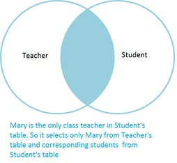
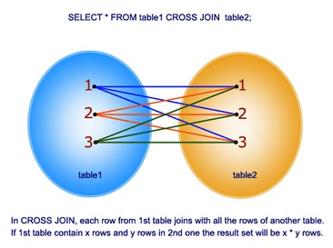

[Repository](https://github.com/mikejakobsen/t-sql)

# Joins

The FROM clause of a query is the  rst clause to be logically processed, and within the FROM clause, table operators operate on input tables.

A JOIN table operator operates on two input tables. The three fundamental types of joins are cross joins, inner joins, and outer joins.

## Cross Join vs Inner Join

Table: Teacher

	x------------------------x
	| TchrId   | TeacherName |
	x----------|-------------x
	|    T1    |    Mads     |
	|    T2    |    Toril    |
	x------------------------x

Table: Student

	x--------------------------------------x
	|  StudId  |    TchrId   | StudentName |
	x----------|-------------|-------------x
	|    S1    |     T1      |    Mike     |
	|    S2    |     T1      |    Jacob    |
	x--------------------------------------x

### INNER JOIN

Inner join selects the rows that satisfies both the table.
> Vælger begge tabeller

Consider we need to find the teachers who are class teachers and their corresponding students. In that condition, we need to apply JOIN or INNER JOIN and will

	SELECT T.TchrId,T.TeacherName,S.StudentName
	FROM #Teacher T
	INNER JOIN #Student S ON T.TchrId = S.TchrId

Resultat

	x--------------------------------------x
	|  TchrId  | TeacherName | StudentName |
	x----------|-------------|-------------x
	|    T1    |     Mads    |    Mike     |
	|    T1    |     Mads    |    Jacob    |
	x--------------------------------------x

### CROSS JOIN

Cross join selects the all the rows from the first table and all the rows from second table and shows as Cartesian product ie, with all possibilities

Consider we need to find all the teachers in the school and students irrespective of class teachers, we need to apply *CROSS JOIN.*0

	SELECT T.TchrId,T.TeacherName,S.StudentName
	FROM #Teacher T
	CROSS JOIN #Student S
Resultat

	x--------------------------------------x
	|  TchrId  | TeacherName | StudentName |
	x----------|-------------|-------------x
	|    T2    |     Toril   |    Mike     |
	|    T2    |     Toril   |    Jacob    |
	|    T1    |     Mads    |    Mike     |
	|    T1    |     Mads    |    Jacob    |
	x--------------------------------------x
