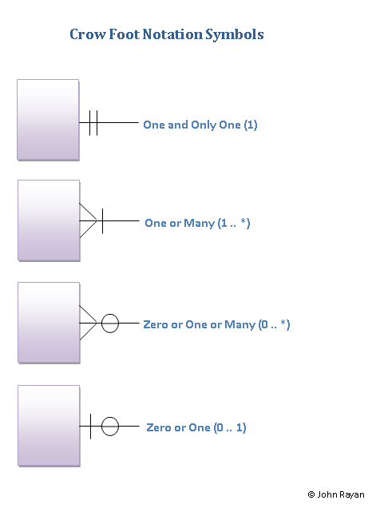
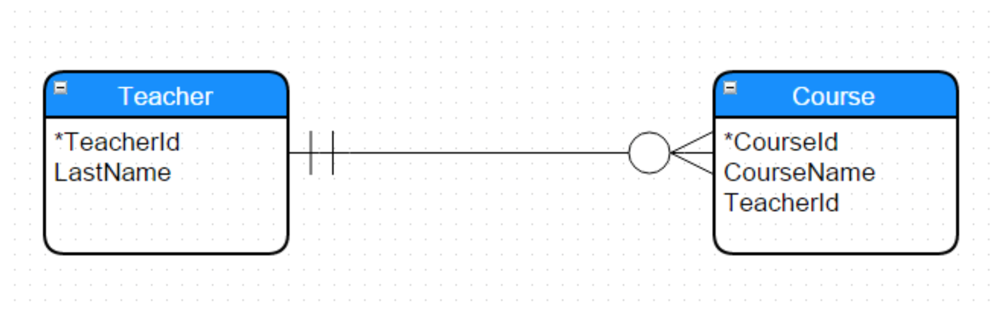

#Crow's Foot Notation

[Empiri Lesson 2](http://www.mikejakobsen.com/pdf/lesson2_db.pdf)

In ERD, there is a wide range of notations used by data architects for denoting the relationship and cardinality between the data entities

One of three relationships can exist between two entities.

	One to One
	One to Many
	Many to Many

### Example

* A car needs a driver (One to One)
* A car has four wheels (One to Many)
* A car can carry more than one person (One to Many)
* A driver is allowed to drive more than one car and a car can be driven by more than one driver (Many to Many).

***A cardinality is the number of rows a table can have in the relationship.***

The possible cardinalities are

	One and Only One

	One or Many

	Zero or One or Many

	Zero or One

A car can carry more than one person, the car will carry minimum one person, which is the driver. Also it can carry many passengers.

> The car has a One to (One or Many) relationship.

### Summary

* A car can have one and only gearknop – One to (One and Only One)

* A driver can drive more than one vehicle but at the same time he doesn’t need to own a car and can use public transport. In this instance the driver drives zero vehicles – **One to (Zero or One or Many)**.

* A car can be declared off the road and doesn’t require a tax disc. In this instance, a car doesn't have a tax disc - **One to (Zero or One)**.

* A car owner or the owner’s spouse or any comprehensive licence holder can drive the owner’s car – **(Many to One)**.

# Crow Foot Notation Symbols

## Data model

1. Conceptual data model - draft ER diagram

2. Logical data model - Uafhængig af tech. Detaljegrad lidt større

3. Physical data model - Final, klar til at implementere

One teacher can have many Courses **One to many** _Optional_
A course needs one teacher, and only one ** Many to one**

