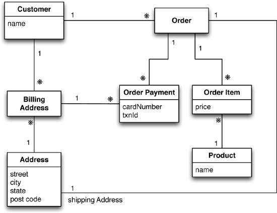
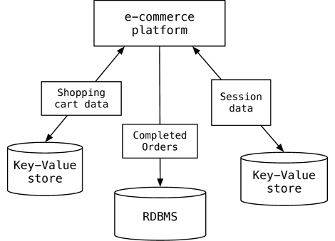

# Datamodelling

[Empiri - Lesson 12](http://www.mikejakobsen.com/pdf/lesson12_db.pdf)
[Teori](https://www.comp.nus.edu.sg/~gilbert/pubs/BrewersConjecture-SigAct.pdf)
[Database Rankings/What's how](http://db-engines.com/en/ranking)

**Polyglot DB** = Uses multiple types of databases.
**Polyglot programming** - Uses multiple languages to optimize the result. E.g. PHP and JavaScript

**Aggregate orientation** is a object based mapping. Linked related data.

**Impedance mismatch** = A basic mismatch in the languages. SQL vs PHP. No mismatch between MongoDB and JavaScript. - *Definition OLM/Elequent*

Relational databases is based on **ACID** *(Atomicity, Consistency, Isolation, Durability)*

**Summary** Many rows spanning many tables are updated as a single operation. This operation either succeeds or fails in its entirety, and concurrent operations are isolated from each other so they cannot see a partial update.

##Polyglot Persistence

Polyglot Persistence is about using different data storage technologies to handle varying data storage needs.

#RDBMS vs NoSQL

**RDBMS**
* Structured and organized data
* Structured query language (SQL)
* Data and it's relationships are stored in separate tables.
* Data Manipulation Language, Data Definition Language
* Tight Consistency
* ACID

**NoSQL**
* Not Only SQL
* No declarative query Language
* No predefined schema
* Key-Value pair storage, Column Store, Document Store, Graph databases
* (BASE) Eventual consistency rather then ACID
* Unstructured and unpredictable data
* CAP Theorem
* High performance, high **scalability**

### Scaling

**Vertical/Up** - Expanding the hard drive.

**Horizontal/Out** - (NoSQL). Add more nodes to a system, and distributing them across the nodes.

### Sharding
[Empri/PDF](../assets/sharding.pdf)

Summary: Sharding is a horizontal partition of data in a database. Simply splitting the DB.

Horizontal partitioning is a design principle whereby rows of a database table are held separately, rather than splitting by columns (as for normalization).

**Pros**

* The total number of rows in each table in each database is reduced
* A database shard can be placed on separate hardware
* Improved performance

**Cons**
* A heavier reliance on the interconnect between servers
* Increased delay when querying
* Issues of consistency and durability due to the more complex failure modes of a set of servers
### Relational model

### NoSQL - (Not Only SQL)

### A mix - NoSQL/Relational

A mixture of data storage's.

Webshop:    Orders and the traditional stuff in a relationel DB.

		Session Data, Shopping cart data fx "Other customers bought"
		Works better in NoSQL/Key-Value.

##CAP

The CAP theorem states that any networked shared-data system can have at most two of three desirable properties:

1. **Consistency (C)** - All clients see the same data.

2. **Availability (A)** always on - no downtime.

3. **Partition Tolerance** - Continues to function in case of failure.

[Video explanation on CAP](https://www.youtube.com/watch?v=Jw1iFr4v58M)

##Base
NoSQL applies BASE instead of ACID.

1. **Basically available** - If a single node fails, part of the data won't be available, but the entire data layer stays operational. Always accepting new data.

	Like a *Check* at some point the money is gonna be there.

2. **Soft state** - Indicates that the state of the system may change over time, even without input. This is because of the eventual consistency model.

	The clusters can change without the user knowing.

3. **Eventual Consistency** - Means that updates will eventually ripple through to all servers, given enough time.

	The money from the check is gonna be there at some point.

*Soft state: A light switch is hard state, which means when you switch it on, it stays on.

*NoSQL* vs *SQL* - Sacrifice the consistency, for the availability.

[Teori](https://www.comp.nus.edu.sg/~gilbert/pubs/BrewersConjecture-SigAct.pdf)

##Acid
1. **Atomicity** - Each transaction is *all or nothing*. If one part of the transaction fails, then the entire transaction fails, and the database state is left unchanged.

		If i transfer 100$ to Anna. SQL withdraws them from my account, then insert them in her's. Either it all works, or nothing is changed.

2. **Consistency** - Any transaction will bring the database from one valid state to another.

		Think Bank account. Add the end of the day, we still have 100$.

3. **Isolation** - A transaction in process and not yet committed must remain isolated from any other transaction. Summary: Separation Of Concerns.

		Serialized - One command at a time. I withdraw, you withdraw.

4. **Durability** - Ensures durability. Committed data is saved by the system such that, even in the event of a failure the data is available in its correct state.

		If the server crashes. The 100$ is still there.

Operations commit or fail in their entirety *(atomic)*, committed transactions are visible to all future transactions *(consistent)*, un- committed transactions are isolated from each other *(isolated)*, and once a transaction is committed it is permanent *(durable)*

* [PolyglotPersistence](http://martinfowler.com/bliki/PolyglotPersistence.html)
* [Polyglot programmer](http://memeagora.blogspot.dk/2006/12/polyglot-programming.html)
* [Down-sides link](http://www.techrepublic.com/article/developers-are-calling-it-quits-on-polyglot-programming/)
