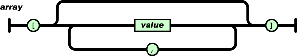

# JSON

JSON syntax is a subset of the JavaScript object notation:

Summary:

* A collection of name/value pairs. - **Object/associative array.**
* An ordered list of values. **Array**

Data is in name-value pairs

	{
		"company": Volkswagen
	}

* Data is separated by commas

		{
			"company": "Volkswagen",
			"name": "Beetle"
		}

* Curly braces hold objects
* Square brackets hold arrays

		{
			"company": "Volkswagen",
				"Cars": [{
					"Color": "Red",
					"Color": "Grey",
					"Color": "Yellow"
				}]
		}

### Object

*An object is an unordered set of name/value pairs.* An object begins with
{ (left brace) and ends with } (right brace). Each name is followed by :
(colon) and the name/value pairs are separated by , (comma).

### Array

*An array is an ordered collection of values.* An array begins with [
(left bracket) and ends with ] (right bracket). Values are separated by ,
(comma).

### Value

A value can be a string in double quotes, or a number, or true or false or
null, or an object or an array.

These structures can be nested.

### String

A string is a sequence of zero or more Unicode characters, wrapped in
double quotes, using backslash escapes. A character is represented as a
single character string. A string is very much like a C or Java string.

### Number

A number is very much like a C or Java number, except that the octal and
hexadecimal formats are not used.

# Javascript and JSON

	var mike = {
		"age" : "24",
		"hometown" : "Bryrup",
		"gender" : "male"
	};

	document.write('Mike is ' mike.age); // Output: Mike is 24
