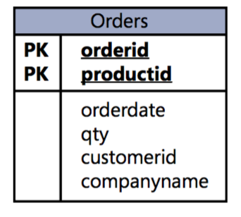
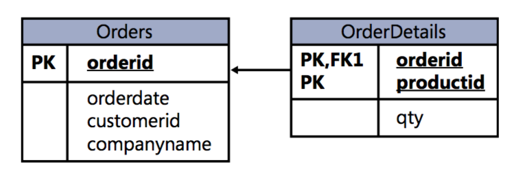
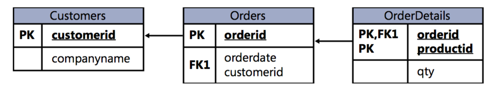

#Normalisation

### 1NF

*Atomic and Primary key*

Each tuples (row) should atomic.
And have a primary key attached.

	| title                   | rating | genre                   |
	|-------------------------|--------|-------------------------|
	| The Martian             | 93     | drama, science fiction  |
	| Guardians of the galaxy | 77     | comedy, science fiction |
	| Star Wars               | 93     | action, science fiction |
	| Brooklyn                | 98     | drama                   |

Genre is wrong - every value should be separate.

### 2NF

* Be in 1NF
* No partial function dependencies. (Look below)

All values should be relevant. - Order is wrong here, and should be a separate entry.

#### Wrong

#### Great

### 3NF

* No transitive functional dependencies.

A query based on the **Primary Key** should only contain info regarding the same content.

*CustomerID* should not contain info regarding orders.

## Data model

1. Conceptual data model - draft ER diagram

2. Logical data model - Uafhængig af tech. Detaljegrad lidt større

3. Physical data model - Final, klar til at implementere

### Crow's Foot Notation.

<http://www2.cs.uregina.ca/~bernatja/crowsfoot.html>

# Functional Dependency

One column, depends on another.

The value of one column, is depending on another.

### Partial functional dependency

A non-key column is dependent on some, but not all of the columns of the composite primary key.

		A non-key column is related to another non-key column

	| city        | state         | st | population |
	|-------------|---------------|----|------------|
	| Santa Fe    | New Mexico    | NM | 67947      |
	| Santa Fe    | Texas         | TX | 12222      |
	| Springfield | Massachusetts | MA | 15360      |
	| Springfield | Illinois      | IL | 11706      |

*Partial*
If we change the state, we'll have to have the change the state abbreviation. *State* and *st*

