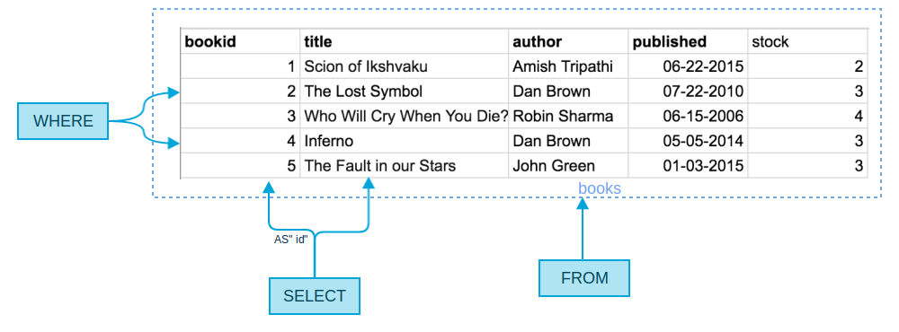
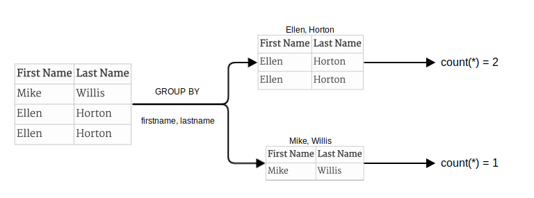

# SQL Mindset

[Git Repository](https://github.com/mikejakobsen/MySQL)

> Is it "`SELECT * WHERE a=b FROM c`" or "`SELECT WHERE a=b FROM c ON *`" ?

If you're anything like me, SQL is one of those things that may look easy at first (it reads just like regular english!), but for some reason you can't help but google the correct syntax for every silly query.<br>
Then, you get to joins, aggregation, and subqueries and everything you read just seems like gibberish. Something like this :

```sql
SELECT members.firstname || ' ' || members.lastname
AS "Full Name"
FROM borrowings
INNER JOIN members
ON members.memberid=borrowings.memberid
INNER JOIN books
ON books.bookid=borrowings.bookid
WHERE borrowings.bookid IN (SELECT bookid
  FROM books
  WHERE stock>(SELECT avg(stock)
    FROM books))
GROUP BY members.firstname, members.lastname;
```

Yikes! This would scare any new comer, or even an intermediate developer looking at SQL for the first time. It shouldn't have to be like this.

It's always easy to remember something which is intuitive, and through this guide, I hope to ease the barrier of entry for SQL newbies, and even for people who have worked with SQL, but want a fresh perspective.

<!-- more -->

_All queries used in this post are made for PostgreSQL, although SQL syntax is very similar across databases, so some of these would work on MySQL, or other SQL databases as well_


## The three magic words

Although there are lots of keywords used in SQL, `SELECT`, `FROM`, and `WHERE` are the ones you would be using in almost every query that you make. After reading ahead, you would realize that these key words represent the most fundamental aspect of querying a database, and other, more complex queries are simply extensions of them.


##  Our database

Let's take a look at the sample data we will be using throughout the rest of this article:

<iframe src="https://docs.google.com/spreadsheets/d/1HX6DhT0vkGzWEjoSKcvUovVN6jbVz6RVYgkQYSTZAuU/pubhtml?widget=true&amp;headers=false" class="google-docs-excel-table">
</iframe>

We have a library, with books and members. We also have another table for borrowings made.

-   Our "books" table has information about the title, author, date of publication, and stock available. Pretty straightforward.
-   Our "members" table only has the first and last name of all registered members.
-   The "borrowings" table has information on the books borrowed by the members. The `bookid` column refers to the id of the book in the "books" table that was borrowed, and the `memberid` column corresponds to the member in the "members" table that borrowed the book. We also have the dates when the books were borrowed, and when they are expected to be returned.

<span id="c-3"></span>

## Simple Query

Let's get started with our first query : We want the _names_ and _ids_ of all books written by "Dan Brown".

Our query would be :

```sql
SELECT bookid AS "id", title
FROM books
WHERE author='Dan Brown';
```

Which would give us :

| id  | title           |
| --- | --------------- |
| 2   | The Lost Symbol |
| 4   | Inferno         |

Simple enough. However, lets try to dissect the query to really understand whats happening.

<span id="c-3-1"></span>

### FROM - Where do we get the data from?

This might seem obvious now, but actually matters a lot when we get to joins and subqueries. `FROM` is there to point our query to its table, the place where it has to look for the data. This table can simply be one that already exists (like the previous example), or a table which we generate through joins or subqueries.

<span id="c-3-2"></span>

### WHERE - What data should we show?

`WHERE`, quite simply acts to filter out the **rows** that we want to show. In our case the only rows we want to consider are those where the value of the `author` column is "Dan Brown"

<span id="c-3-3"></span>

### SELECT - How should we show it?

Now that we got all the rows we wanted from the table that we wanted, the question that arises is what exactly do we want to show out of the data that we got? In our case we only need the name and id of the book, so that's what we `SELECT`. We can also rename the columns we want to show with `AS`.

In the end, you can represent the entire query as a simple diagram :



<span id="c-4"></span>

## Joins

We would now like to see the names of all books (not unique) written by "Dan Brown" that were borrowed, along with the date of return :

```sql
SELECT books.title AS "Title", borrowings.returndate AS "Return Date"
FROM borrowings JOIN books ON borrowings.bookid=books.bookid
WHERE books.author='Dan Brown';
```

Which would give us :

| Title           | Return Date         |
| --------------- | ------------------- |
| The Lost Symbol | 2016-03-23 00:00:00 |
| Inferno         | 2016-04-13 00:00:00 |
| The Lost Symbol | 2016-04-19 00:00:00 |

<br>
Most of the query looks similar to our previous example _except_ for the `FROM` section. What this means is that _the table we are querying from ha changed_. We are neither querying the "books" table nor the "borrowings" table. Instead, we are querying a _new table_ formed by joining these two tables.

`borrowings JOIN books ON borrowings.bookid=books.bookid` can be considered as another table formed by combining all entries from the books table and the borrowings table, as long as these entries have the same `bookid` in each table. The resultant table would be :

<iframe src="https://docs.google.com/spreadsheets/d/1pHCgnSNmS3ut192JB6gAjzeJ1XmL9vRiaPvCl7aWZkE/pubhtml?gid=867473953&amp;single=true&amp;widget=true&amp;headers=false" class="google-docs-excel-table"></iframe>

Now, we just query this table like we did in the simple example above. This means that everytime we join a table, we just have to worry about how we join our tables. After that, the query is reduced in complexity to the level of the "Simple Query" example.

Let's try a slightly more complex join where we join 2 tables.

We now want the first name and last name of everyone who has borrowed a book written by "Dan Brown".

This time, we'll take a bottom-up approach to get our result :

-   **Step 1** - Where do we get the data from?
    To get the result we want, we would have to join the "member" table, as well as the "books" table with the "borrowings" table.
    The join section of the query would look like :

    ```sql
    borrowings
    JOIN books ON borrowings.bookid=books.bookid
    JOIN members ON members.memberid=borrowings.memberid
    ```

    The resulting table would be :

    <iframe src="https://docs.google.com/spreadsheets/d/1pHCgnSNmS3ut192JB6gAjzeJ1XmL9vRiaPvCl7aWZkE/pubhtml?gid=1040789930&amp;single=true&amp;widget=true&amp;headers=false" class="google-docs-excel-table"></iframe>

-   **Step 2** - What data should we show?
    We are only concerned with data where the author is "Dan Brown"

    ```sql
    WHERE books.author='Dan Brown'
    ```

-   **Step 3** - How should we show it?
    Now that we got the data we want, we just want to show the first name and the last name of the members who borrowed it :

    ```sql
    SELECT
    members.firstname AS "First Name",
    members.lastname AS "Last Name"
    ```

Awesome! Now we just have to combine the 3 components of our query and we get :

```sql
SELECT
members.firstname AS "First Name",
members.lastname AS "Last Name"
FROM borrowings
JOIN books ON borrowings.bookid=books.bookid
JOIN members ON members.memberid=borrowings.memberid
WHERE books.author='Dan Brown';
```

Which gives us :

| First Name | Last Name |
| ---------- | --------- |
| Mike       | Willis    |
| Ellen      | Horton    |
| Ellen      | Horton    |

Awesome! Although, the names are repeating (non-unique). We'll get to solving that in a bit...

<span id="c-5"></span>

## Aggregations

In a nutshell, _aggregations are used to convert many rows into a single row_. the only thing that changes is the logic used on each column for its aggregation.

Let's continue with our previous example, where we saw that there were repetitions in the results we got from our query. We know that Ellen Horton borrowed more than one book, but this is not really the best way to show this information. We can write another query :

```sql
SELECT
members.firstname AS "First Name",
members.lastname AS "Last Name",
count(*) AS "Number of books borrowed"
FROM borrowings
JOIN books ON borrowings.bookid=books.bookid
JOIN members ON members.memberid=borrowings.memberid
WHERE books.author='Dan Brown'
GROUP BY members.firstname, members.lastname;
```

Which would give us our required result :

| First Name | Last Name | Number of books borrowed |
| ---------- | --------- | ------------------------ |
| Mike       | Willis    | 1                        |
| Ellen      | Horton    | 2                        |

<br>
Almost all aggregations we do come with the `GROUP BY` statement. What this does is convert the table otherwise returned by the query into groups of tables. Each group corresponds to a unique value (or group of values) of columns which we specify in the `GROUP BY` statement.  
In this example, we are converting the result we got in the previous exercise into groups of rows. We also perform an aggregation in this case `count`, which converts multiple rows into a single value (which in our case is the number of rows). This value is then attributed to each group.

Each row in the result represents the aggregated result of each of our groups.



We can also logically come to the conclusion that all fields in the result must either be specified in the `GROUP BY` statement, or have an aggregation done on them. This is because all other fields will vary row wise, and if they were `SELECT`ed, we would'nt know which of their possible values to take.

In the above example, the `count` function worked on all rows (since we are only counting the number of rows). Other functions like `sum` or `max`, would work on only a specific row. For example, if we want the total stock of all books written by each author, we would query :

```sql
SELECT author, sum(stock)
FROM books
GROUP BY author;
```

And get the result :

| author         | sum |
| -------------- | --- |
| Robin Sharma   | 4   |
| Dan Brown      | 6   |
| John Green     | 3   |
| Amish Tripathi | 2   |

<br>

Here the `sum` function, only works on the `stock` column, summing all values for each group.

<span id="c-6"></span>

## Subqueries


Sub queries are regular SQL queries, that are embedded inside larger queries.

There are 3 different types of subqueries, based on what they return -

<span id="c-6-1"></span>

### Two-dimensional table

These are queries that return more than one column. A good example is the query we performed in the previous aggregation excercise. As a subquery, these simply return another table which can be queried further. From the previous excercise, if we only want the stock of books written by "Robin Sharma", one way of getting that result would be to use sub-queries :

```sql
SELECT *
FROM (SELECT author, sum(stock)
  FROM books
  GROUP BY author) AS results
WHERE author='Robin Sharma';
```

Result :

| author       | sum |
| ------------ | --- |
| Robin Sharma | 4   |

<br>

<span id="c-6-2"></span>

### One-dimensional array

Queries which return multiple rows of a single column, can be used as arrays, in addition to being used as Two-dimensional tables.

For example, lets say we want to get the titles and ids of all books written by an author, whose total stock of books is greater than 3.  
We can break this down into 2 steps -

1.  Get the list of authors with total stock of books greater than 3. Building on top of our previous example, we can write :

    ```sql
    SELECT author
    FROM (SELECT author, sum(stock)
      FROM books
      GROUP BY author) AS results
    WHERE sum > 3;
    ```

    Which gives us :

    <table>
    <tr>
    <th>author</th></tr>
    <tr><td>Robin Sharma</td></tr>
    <tr><td>Dan Brown</td></tr>
    </table>

    Which can also be written as : `['Robin Sharma', 'Dan Brown']`

2.  We then use this result in our next query :

    ```sql
    SELECT title, bookid
    FROM books
    WHERE author IN (SELECT author
      FROM (SELECT author, sum(stock)
      FROM books
      GROUP BY author) AS results
      WHERE sum > 3);
    ```

    Which gives us :

    | title                      | bookid |
    | -------------------------- | ------ |
    | The Lost Symbol            | 2      |
    | Who Will Cry When You Die? | 3      |
    | Inferno                    | 4      |

    This is equivalent to writing :

    ```sql
    SELECT title, bookid
    FROM books
    WHERE author IN ('Robin Sharma', 'Dan Brown');
    ```

<span id="c-6-3"></span>

### Single Values

These are queries whose results have only one row and one column. These can be treated as a constant value, and can be used anywhere a value is used, like for comparison operators. They can also be used like two dimensional tables, as well as an array containing 1 element.

As an example, let's find out information about all books having stock above the average stock of books present.

The average stock can be queried using :

```sql
select avg(stock) from books;
```

Which gives us :

<table>
<tr><th>avg</th></tr>
<tr><td>3.000</td></tr>
</table>

Which can also be used as the scalar value `3`.

So now, we can finally write our query :

```sql
SELECT *
FROM books
WHERE stock>(SELECT avg(stock) FROM books);
```

Which is equivalent to writing :

```sql
SELECT *
FROM books
WHERE stock>3.000
```

And which gives us :

| bookid | title                      | author       | published           | stock |
| ------ | -------------------------- | ------------ | ------------------- | ----- |
| 3      | Who Will Cry When You Die? | Robin Sharma | 2006-06-15 00:00:00 | 4     |

<span id="c-7"></span>

## Write Operations

Most of the write operations in a database are pretty straightforward, as compared to the more complex read queries.

<span id="c-7-1"></span>

### Update

The syntax of `UPDATE` queries are semantically similar to read queries. The only difference however, is that instead of `SELECT`ing columns from a bunch of rows, we `SET` those columns instead.

If we suddenly lost all of our books written by "Dan Brown", we would like to update the stock to make it 0. For this we would write :

```sql
UPDATE books
SET stock=0
WHERE author='Dan Brown';
```

`WHERE` still performs the same function here, which is that of choosing rows. Instead of `SELECT` which we used in our read queries, we now use `SET`. However, now, in addition to mentioning the column names, you also have to mention the new value of the columns in the selected rows as well.


<span id="c-7-2"></span>

### Delete

A `DELETE` query is simply a `SELECT`, or an `UPDATE` query without the column names. Seriously. As in `SELECT` and `UPDATE`, the `WHERE` clause remains as it is, selecting rows to be deleted. Since a delete operation removes an entire row, there is no such thing as specifying column names to delete. Hence is instead of updating the stock to 0, if we just deleted the entries from Dan Brown all together, we would write :

```sql
DELETE FROM books
WHERE author='Dan Brown';
```

<span id="c-7-3"></span>

### Insert

Possibly the only outlier from the other query types is the `INSERT` query. Its format is :

```sql
INSERT INTO x
  (a,b,c)
VALUES
  (x, y, z);
```

Where `a`, `b`, `c` are the column names and `x`, `y`, and `z` are the values to be inserted into those columns, in the same order in which they are specified. That's pretty much all there is to it.

For a more concrete example, here is the `INSERT` query to input the entire data of the "books" table :

```sql
INSERT INTO books
  (bookid,title,author,published,stock)
VALUES
  (1,'Scion of Ikshvaku','Amish Tripathi','06-22-2015',2),
  (2,'The Lost Symbol','Dan Brown','07-22-2010',3),
  (3,'Who Will Cry When You Die?','Robin Sharma','06-15-2006',4),
  (4,'Inferno','Dan Brown','05-05-2014',3),
  (5,'The Fault in our Stars','John Green','01-03-2015',3);
```

<span id="c-8"></span>

## Feedback

Now that we have come to the end of the guide, it's time for a small test. Take a look at the first query at the very beginning of this post. Can you try to figure out what it does? Try breaking it down into its `SELECT`, `FROM`, `WHERE`, `GROUP BY`, and subquery components.  

Here it is written in a more readable way :

```sql
SELECT members.firstname || ' ' || members.lastname AS "Full Name"

FROM borrowings
INNER JOIN members
ON members.memberid=borrowings.memberid
INNER JOIN books
ON books.bookid=borrowings.bookid

WHERE borrowings.bookid IN (SELECT bookid FROM books WHERE stock>  (SELECT avg(stock) FROM books)  )

GROUP BY members.firstname, members.lastname;
```

It's actually the list of all members who borrowed any book with a total stock that was above average.

Result :

<table>
<tr><th>Full Name</th></tr>
<tr><td>Lida Tyler</td></tr>
</table>

