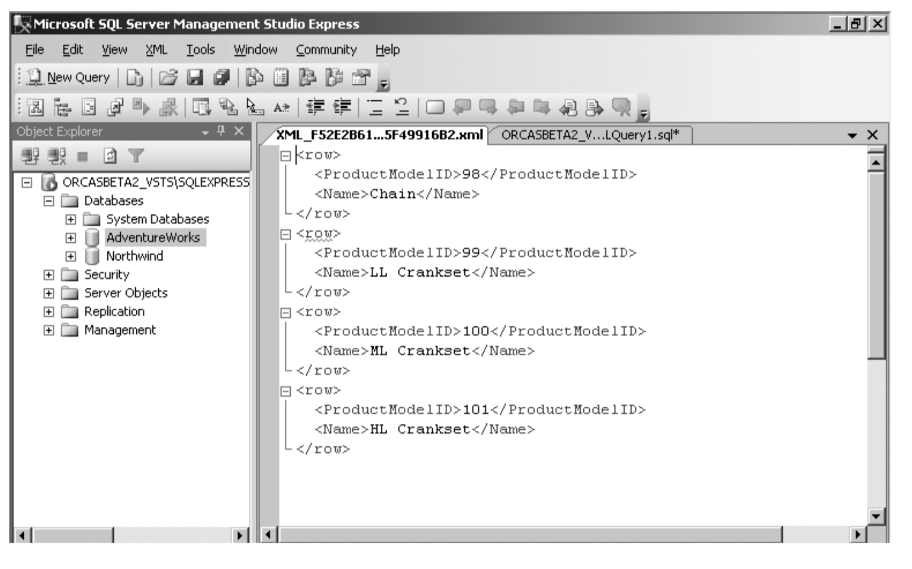

#XML

[Empiri XML](http://www.mikejakobsen.com/pdf/xml.pdf)

**Meta-language** isn’t used for programming but rather for defining other languages, and the languages XML defines are known as **markup languages.**
Used for *Marking up something*.

* XML is extensible: it does not consist of a fixed set of tags; <random></random>
* XML documents must be well-formed according to a defined
syntax.
* An XML document can be formally validated against a schema
of some kind.
* XML is more interested in the meaning of data than in its
presentation.

Tags
`<food></food>`
An Attribute
`<grade id="1">`
Value
`<name>Mike</name>`

### Json
	{
		"company": "Volkswagen",
		"name":		 "vento",
		"price":		 80000
	}
### XML

	<car>
		<company>Volkswagen</company>
		<name>Vento</name>
		<price>80000</price>
	</car>

## Tree Structure

XML documents has a tree structure.

An XML tree starts at a `root element` and branches from the root to `child elements.`

	<root>
		<child>
			<subchild>.....</subchild>
		</child>
	</root>

The <book> elements have 4 child elements: <title>,< author>, <year>, <price>.

	<title lang="en">Everyday Italian</title>
		<author>Giada De Laurentiis</author>
		<year>2005</year>
	<price>30.00</price>

## Retrieve XML from SQL queries

SQL

	SELECT album.Title, Kunstner.Name
	FROM dbo.Artist as Kunstner
	INNER JOIN dbo.Album
	ON Kunstner.ArtistId=Album.ArtistId
	WHERE Kunstner.Name = 'Frank Sinatra'
	FOR XML AUTO;

XML

	<dbo.Album Title="My Way: The Best Of Frank Sinatra [Disc 1]">
	<Kunstner Name="Frank Sinatra" />
	</dbo.Album>

### Retrive from SQL in XML

	SELECT ProductModelID, Name
	FROM Production.ProductModel
	WHERE ProductModelID  between 98 and 101
	FOR XML RAW

Result

It turns each row in the result set into an XML row empty element and uses an attribute for each of the column values, using the alias names you specify in the query as the attribute names.

		FOR XML RAW,ELEMENTS

It turns each row in the result set where each column is converted into an attribute.

### XML and SQL

	create table xmltest
	(
	 xid  int not null primary key,
	 xdoc xml not null
	 )
