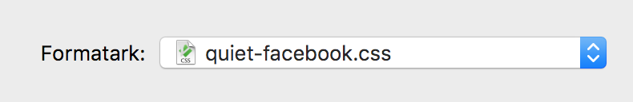

# Remove spam from Facebook

If you are kinda like me. You probably hate, all the noise on Facebook.

I made a custom stylesheet to remove, all the unnecessary spam on there.

** Notice: Safari loads a custom stylesheet as a formatark*



Add the following CSS

```
#pagelet_bookmark_nav, /* Left column: Bookmarks */
a[href*="lists"], /* Left column: Lists like 'Close Friends' */
  div[id*="ticker"], /* Right column / Chat sidebar: news ticker */
  div[id*="pagelet_reminders"], /* Fødselsdagstingen */
  div[id*="appsNav"], /* Gamesnav */
  div[id*="pagelet_trending_tags_and_topics"] /* Right column: Trending tags and topics */
{
display: none !important;
}

/* News feed - Needs visibility:hidden to prevent endless refreshing */
div[id*="topnews"] { 
visibility: hidden !important;
}
```

