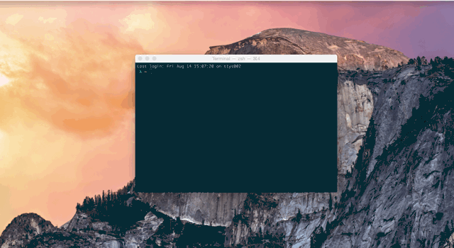

#Resize terminal script

### Install
Build using Applescript

	git clone https://github.com/apaszke/termtile
	cd termtile; ./install.sh

	Delete the repo afterwards.

### Aliases

* ll - fill left half of the screen
* rr - fill right half
* up - fill upper half
* down - fill lower half
* ul - fill upper-left quarter
* ur - fill upper-right quarter
* dl - fill lower-left quarter
* dr - fill lower-right quarter
* big - make the window bigger
* cen - center the window
* max - maximize the window
* sn - move to the next display
* fs - toggles terminal app fullscreen
