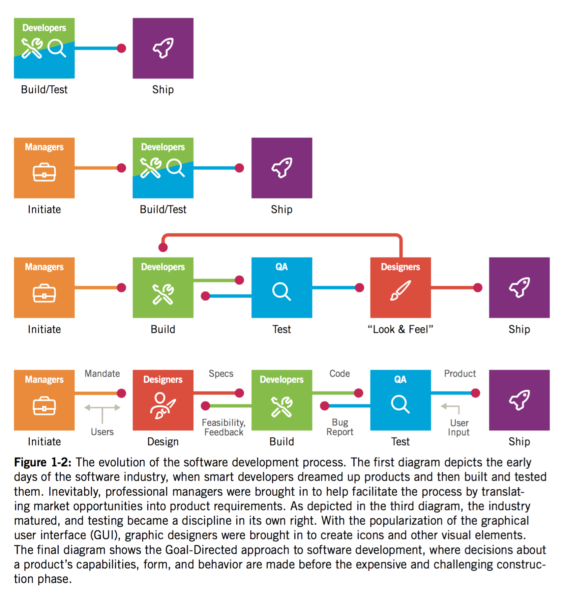
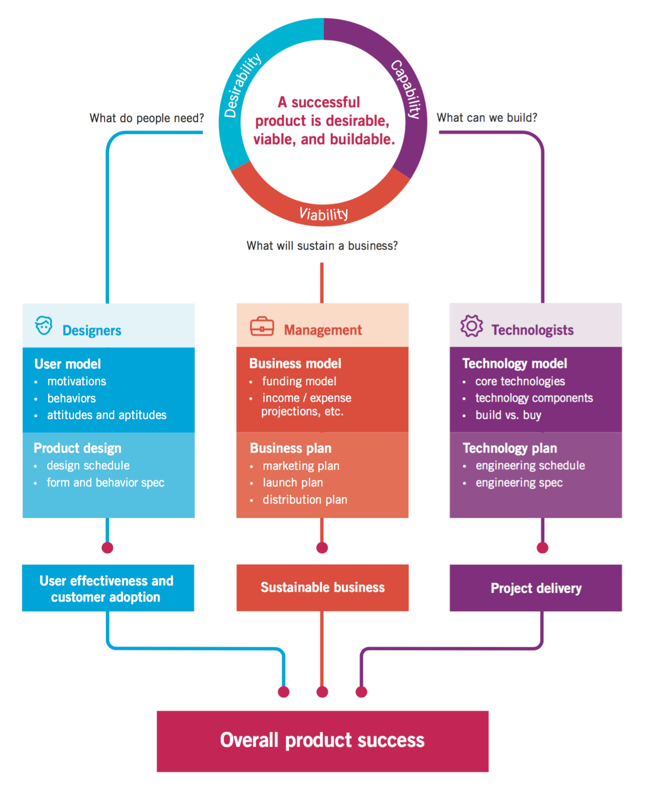
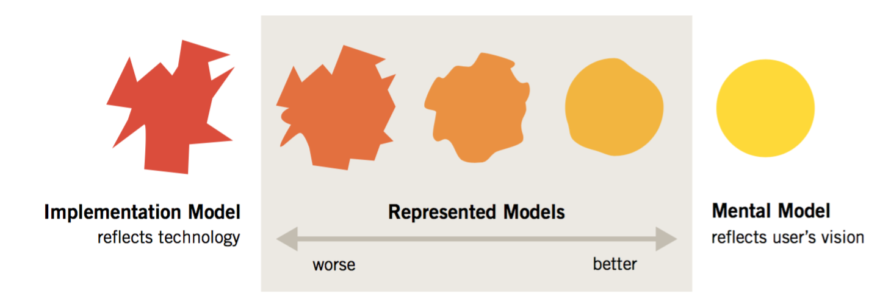
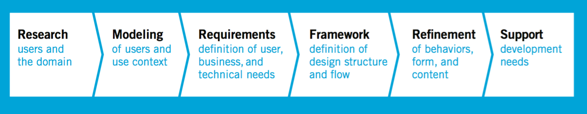

Bøger:

[About Face The Essentials of Interaction Design, 4th Edition - Alan Cooper](http://www.mikejakobsen.com/pdf/bogen.pdf)

[The Design Of Everyday Things - Donald A. Norman.epub](http://www.mikejakobsen.com/pdf/TheDesignOfEverydayThings.epub)
(Er på din Kindle)

# Why digital products fail

Fokus på tekniske løsninger kontra brugsmønster.

* Mærkelige prioriteringer
* Uvidende omkring slutbrugeren
* Conflicts of interest - Når teamet står for design samt user experience
* Manglende designfokus

### Mærkelig prioritering

Indledende krav matcher ikke hvad slutbrugeren reelt skal opnå.

> Unfortunately, reducing an interactive product to a list of a hundred features doesn’t lend itself to the kind of graceful orchestration that is required to make complex technology useful. Adding “easy to use” as a checklist item does nothing to improve the situation.

The people who are most often responsible for creating our digital products rarely take into account the users’ goals, needs, or motivations.

### Uvidende omkring slutbrugeren

De fleste produkter bliver udviklet uden ordentlig forståelse for brugeren.

Hvorfor skal de vælge vores produkt?

### Conflicts of interest

> Conflict of interest:  People who build the products—developers—are often also the people who design them.

### Manglende designfokus

Udviklere fokuserer på udviklingen og de teknologiske aspekter. Kontra brugsmønster og design.

> Design is a specialized skill, just like software development. Developers would never ask users to help them code; design problems should be treated no differently.

***

# Planning and designing product behavior

Lige så vel som en arkitekt kræves at forstå, folks brug af et hus. Kræves det at en designer forstår folks brugsmønster af software.

> In the early days of industrial manufacturing, engineering and marketing processes alone were sufficient to produce desirable products: It didn’t take much more than good engineering and reasonable pricing to produce a hammer, diesel engine, or tube of toothpaste that people would readily purchase.

Senere forstod folk så at de var nød til at differencer sig via design.

> Interaction design isn’t merely a matter of aesthetic choice; rather, it is based on an understanding of users and cognitive principles.

*Forståelse for brugerens brugsmønster*

### 3 overordnede processer skal følges ad

1. Desirability - Hvad folk have?
2. Viability - Hvad er holdbart? Hvad kan vi sælge?
3. Capability - Kan vi lave det? Teknologi.

#Recognizing User Goals

Hvad er user goals så?

User goals er ofte forskellige fra hvad vi tror.

> Products designed and built to achieve business goals alone will eventually fail; users’ personal goals need to be addressed. When the design meets the user’s personal goals, business goals are achieved far more e ectively, for reasons we’ll explore in more detail in later chapters.

### Dårligt design kan:

* Make users feel stupid.
* Cause users to make big mistakes.
* Require too much effort to operate effectively.
* Don’t provide an engaging or enjoyable experience.

> Finally, when companies do focus on the users, they tend to pay too much attention to the tasks users engage in and not enough attention to their goals in performing those tasks.

Software kan være godt, men stadig opfattes som dårlig. Hvis bruger oplevelsen er dårlig.

Fokuser på brugerens endelig mål, i stedet for **tasks** på vejen. Evt. fjern unødige tasks.

# Goals vs tasks and activities

Goals er slut produktet. Hvor brugeren skal ende.
Task og activities er skridt, eller betingelser på vejen mod det mål.
> Goals motivate people to perform activities; understanding goals allows you to understand your users’ expectations and aspirations, which in turn can help you decide which activities are truly relevant to your design.

User goal vil derfor muligvis ikke ændres. Men i takt med at teknologien ændres vil task og activities på vejen muligvis ændres.

### Recap

_Rejsen fra A til B. Er User goal. I 1950 var task at tage bilen. activity at køre den._

_Nu: User goal: det samme. Task og activity er via Fly_

*Se på user goals alene, for at optimere rejsen dertil.*

#Designing to meet goals in context

> Many designers assume that making user interfaces and product interactions easier to learn should always be a design target.

Andre gange, kan det være med fokus på udførelsen. Fx. Command + Space på Mac til at åbne programmer hurtigt og effektivt. Kontra Launchpad, der fremstår langt flottere og mere tilgængelig.

> If the task is to enter 5,000 names and addresses into a database, a smoothly functioning data-entry application won’t satisfy the user nearly as much as an automated system that extracts the names from the invoicing system.

### Recap

_Selv om det er brugerens opgave at fokusere på sine opgaver, er designerens opgave at se ud over den opgave, at identificere, hvem de vigtigste brugere er, og derefter at bestemme, hvad deres mål (User goal) kunne være og hvorfor._

# Implementation Models and Mental Models

[Implementation model](http://www.mikejakobsen.com/pdf/implementationmodel.pdf)

__Brugeren kommer med en model baseret på tidligere erfaring.__

I stedet for at følge brugerens normale tankegang, følger software en helt anden. Hvilket kan skabe en dårlig bruger oplevelse.

> Brugeren går ud fra headeren indeholder menu samt logo. Der kan derfor opstå frustration hvis der ikke gør.

### Mental models/Conceptual model

Brugeren forholder sig blot til det de ser.

_For brugeren er der ingen grund til at forstå hvordan en bil fungerer. Men blot speederen, bremsen etc._

> They create a cognitive shorthand for explaining it.  is explanation is powerful enough to cover their interactions with it but doesn’t necessarily reflect its actual inner mechanics.

### Recap - Implementation Models and Mental Models

In the digital world, however, the differences between a user’s mental model and the implementation model are often quite distinct. We tend to ignore the fact that our cell phone doesn’t work like a landline phone; instead, it is actually a radio transceiver that might swap connections between a half-dozen different cellular base antennas in the course of a two-minute call. Knowing this doesn’t help us understand how to use the phone.

#Represented models

Den tredje model - _Designerems - represented model_

Hvor designeren vælger at repræsentere et programs funktion for brugeren. Donald Norman kalder dette designer's model.

For eksempel kan OSX få en netværk server til at fremstå som om det var en lokal disk. Designeren viser dermed ikke det faktum, at den fysiske diskdrev kan være langt væk rent fysisk.

## Recap - De tre modeller

Jo tættere den repræsenterede model leveres til brugerens mentale model, jo lettere vil han kunne bruge og forstå programmet.

__Implementation model, mental model, og represented model.__

Den måde udvikleren skal bygge software er ofte dikteret af forskellige tekniske og forretningsmæssige begrænsninger. Den model for, hvordan softwaren rent faktisk virker kaldes __implementation model__.

Den måde brugere opfatter de __goals__, de skal gøre, og hvordan programmet hjælper dem gøre det er deres mentale model. Den er baseret på deres egne ideer om, hvordan de gør dette.

Den måde designere vælger at repræsentere bearbejdning af ansøgningen til brugeren kaldes __represented model__.

__Defination:__

>En af designerens vigtigste mål bør derfor være at få den repræsenterede model til at passer en brugers mentale model så tæt som muligt. Derfor er det afgørende, at designerne forstår i detaljer, hvordan brugeren tænker. Samt forstår deres software.

# Goal-Directed Design

Industrien har indset at user research er essentielt.

> Problematik: Translating research results into design solutions. Et hundrede siders brugerinterview, er ikke nemt at oversætte til en kravsspecifikation.

Tidligere ansås design som et visual facelift af implementation modellen.

###Defination:

Design burde:

> Identifies user requirements and defines a detailed plan for the behavior and appearance of products. In other words, design provides true product definition, based on user goals, business needs, and technology constraints.

#Designers as researchers

Hvis design skal være en produkt definition, skal designerens rolle udvides.

Rollerne burde flyde sammen. Samt designerene skal sætte sig i brugerens sted.

> Instead, we need an explicit, systematic process to bridge the gap between research and design for de ning user models, establishing design requirements, and translating those into a high-level interaction framework

### Goal-directed design process

_Se Figur side 55_

1. Research
2. Modeling
3. Requirements - Kravspecifikation
4. Framework - Overliggende platform
5. Refinement
6. Support

