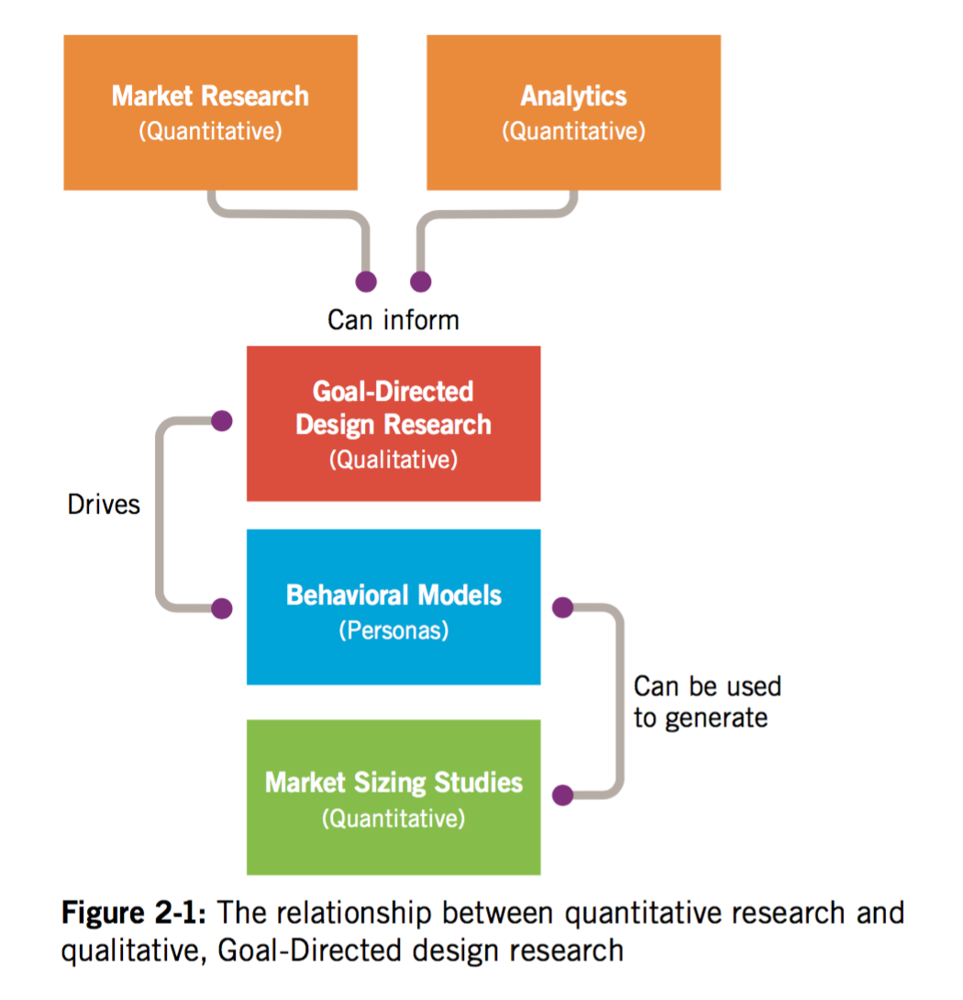
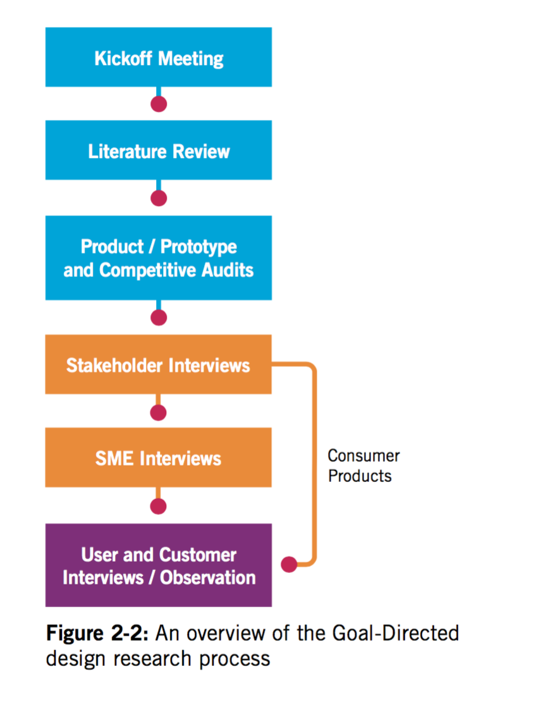

# Design research - Chapter 2

## Kvantitativ vs kvalitativ data i Design Research

Kvantitativ kan kun besvare __"Hvor mange?"__, __"Hvor meget?"__.

Menneskers adfærd er for komplekst til at kun defineres via kvantitativ data.

### Kvalitativ research (Spørge folk)

_Hjælper os med at forstå_

* 	Behaviors, attitudes, and aptitudes of potential and existing product users
* 	Technical, business, and environmental contexts—the domain—of the product to be
designed
*   Vocabulary and other social aspects of the domain in question
* 	How existing products are used

### Kvantitativ research (Stats)

Til at segmentere brugerne

> Market segmentation is a great tool for identifying and quantifying a market opportunity, but it’s an ineffective tool for defining a product that will capitalize on that opportunity.
Kvantitativ data fra fx. analytics.

Difinition:

Kan hjælpe med at fastslå et marked/behov, men ikke hvad det marked mangler. Eller hvad behovet er præcist.
> If you know X people might buy a product or service for Y dollars, it is easier to evaluate the potential return on investment.

# Goal-Directed Design Research

Relevant kvalitativ research

