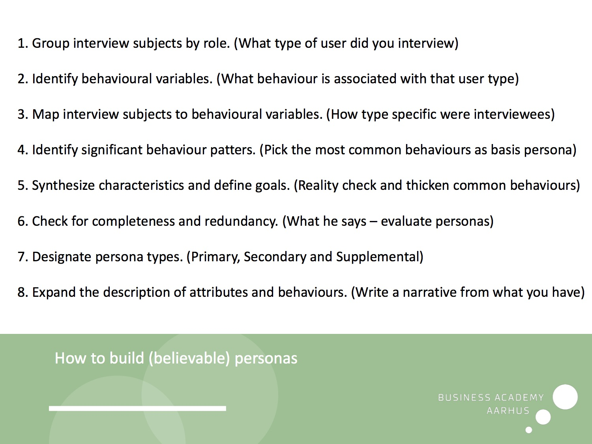

# Personas and Goals

Personas er user models, der skaber en _person_.

## Faldgrupper. Side 64-

1. The elastic user

Vagt definerede personaeres _The elastic user_. Drejer personaet i en retning, der hjælper ens mål.

2. Self-referential Design

Når designer/udvikler overfører sig selv til personaet.

3.	Edge cases

Urealistiske scenarier som alligevel aldrig kommer til at ske.
Personas giver et reality check.

## Personaere afspejler brugere

Et persona omfatter et _behavior pattern_. Altså en måde en bruger benytter produktet.

Personaet har en motivation for at gøre ting - vigtigt at indbefatte som et goal _User goal_ _(Side 68)_.

# User roles

> A user role or role model, as defined by Larry Constantine, is an abstraction—a defined relationship between a class of users and their problems, including needs, interests, expectations, and patterns of behavior.

## User goals

Umuligt for personer at besvare. Skal helst udledes fra kvantitativ data/observation.

One of the most critical tasks in the modeling of personas is identifying goals and expressing them succinctly: Each goal should be expressed as a simple sentence.

> User goals serve as a lens through which designers must consider a product’s functions.  The product’s function and behavior must address goals via tasks—typically, as few tasks as necessary. Remember, tasks are only a means to an end; goals are that end.

## User goals og cognitive processor

1. Visceral
	> Det visuelle niveau. Fange brugeren.

2. Behavioral
	> Hvordan produktet opfører sig. Den reele brugssituation.
3. Reflectice
	> Refleksion. Tidligere erfaring/minder brugeren kommer til situationen med.
