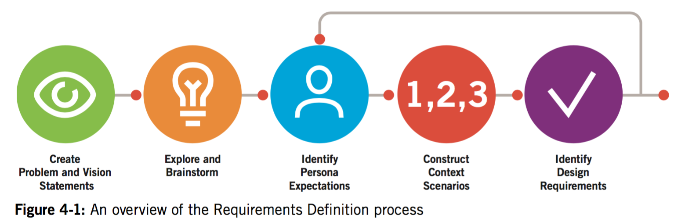

# Scenarios and design requirements

### Research-design Gap

__Problematik:__

> How they all fit together into a coherent product that satisfies both user and business needs.

  *	Developing stories or scenarios as a means of imagining ideal user interactions (Brugerscenarie)
  *	Using those scenarios to extract design requirements (User Goals)
  *	Using these requirements in turn to define the product’s fundamental _interaction framework_
  *	Filling in that framework with ever-increasing amounts of design detail
### Narrative as a Design Tool (Storytelling)

Interaction design is first and foremost the design of behavior that occurs over time.

__Goal-Directed scenarios__ er en iterativ måde at definere hvordan software skal opføre sig fra brugerens vinkel. _(Persona)_
> Goal-Directed scenarios are an iterative means of defining a product’s behavior from the standpoint of specific users (personas)

__Use cases__ er langt mere tekniske. Hver enkel funktionalitet. Uden at tage højde for brugeren direkte.

#### Definition
Use cases har oprindelse i software engineering. Goal directed scenarios er opstået senere med interaction design. Og tager dermed i større grad højde for brugeren.
__User stories__
*“As a user, I would like to log in to my online banking account.”*

> They don’t describe the user’s entire flow at a big-picture level or describe what the user’s end goal is.

### Persona-based scenarios
*Persona-based scenarios* er en narrativ beskrivelse af hvordan et persona benytter et produkt for at opnå et specifikt mål. De beskriver en ideel bruger oplevelse.
- Og gør det dermed muligt at fokusere på personaet, frem for at fokusere på teknologien eller business goals.

> Scenario content and context are derived from information gathered during the Research phase and analyzed during the Modeling phase.

*Context scenario* - hvordan produktet bedst opfylder brugerens behov. (Ideel brugssituation)

>  They are written from the persona’s perspective, focusing on human activities, perceptions, and desires.

# Design Requirements: The “What” of Interaction (Kravsspecifikation)

Hvilke informationer kræver brugeren, samt hvad kræves for at han kan opnå deres mål.

The Requirements Definition phase determines the what of the design: what information and capabilities our personas require to accomplish their goals.

####Definition:

Forfatter begynder heller ikke at male deres illustrationer. Inden de har fastlagt hvem der skal indgå i deres fortælling.

> Define what the product will do before you design how the product will do it.

####Design requirements as being synonymous with needs.
