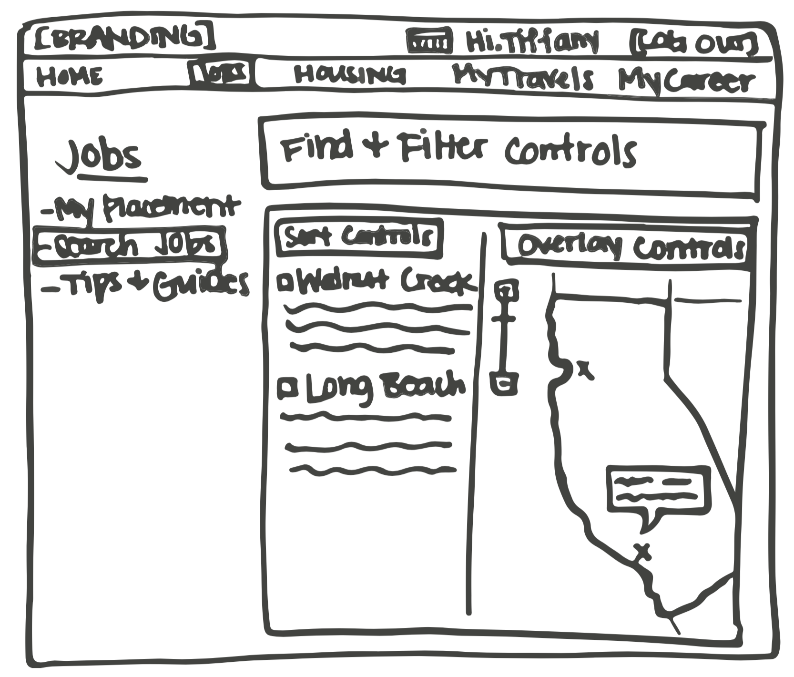

#Framework and refinement

> Instead we should take a top-down approach, concerning ourselves  first with the big picture and rendering our solutions without specific detail in a low fidelity manner.

1. Define form factor, posture, and input methods.
2. Define functional and data elements.
3. Determine functional groups and hierarchy.

4. Sketch the interaction framework.
5. Construct key path scenarios.
>  These scenarios depict the primary pathways through the interface that the persona takes with the greatest frequency, often on a daily basis. Unlike the goal-oriented context scenarios, key path scenarios are more task-oriented, focusing on task details broadly described and hinted at in the context scenarios. (In this way they are similar to Agile use cases.)
6. Check designs with validation scenarios.

> Foregår snarere i et loop, end et lineært.

### Punkt 3. Simpelt udkast af interface

### Punkt 4. Lidt højere fidelity

#Defining the visual design framework

En parallel proces.

 1. Develop experience attributes.
 2. Develop visual language studies.
 3. Apply the chosen visual style to the screen archetype.

