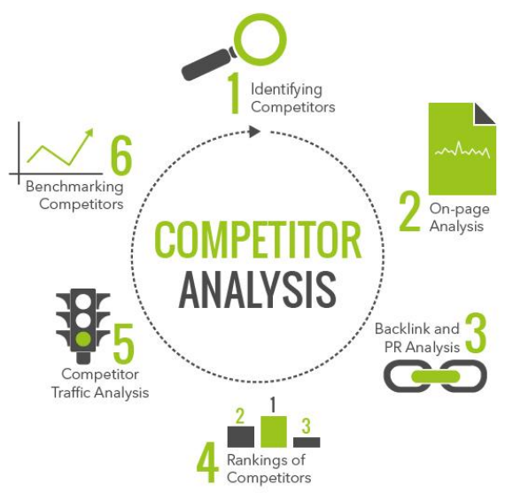
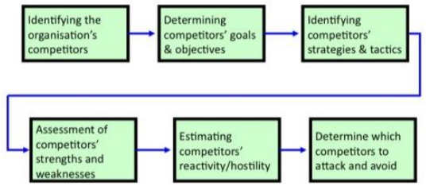
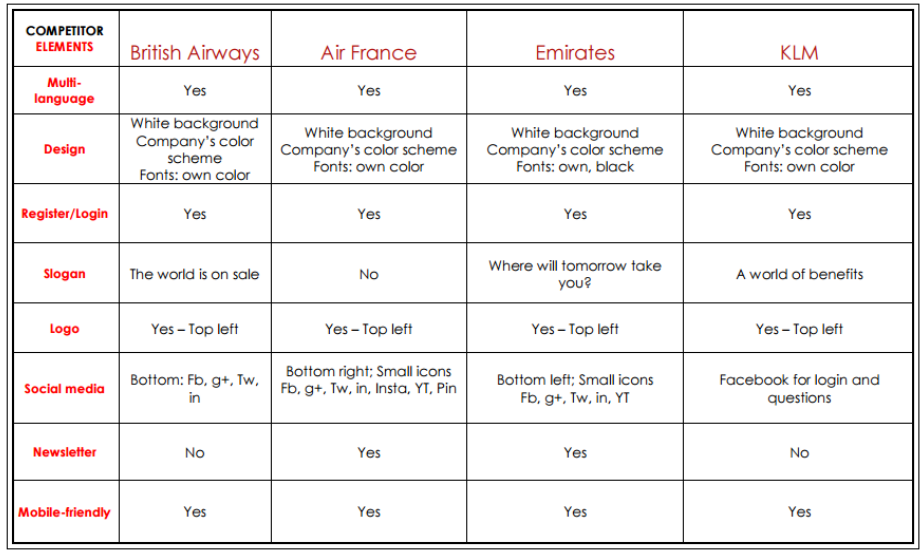

#Competitor Analysis
Stolen from Mikkel. <http://steffenp.dk/weblog/competitor-analysis/>

## Why Competitor Analysis?

Important to have an deep insight in competitors product, communication, functions and possibly processes. Looking at competitors shows you how others interpret what your users needs. Looking at users shows you what users actually need (mostly….).

### Why?

– Make sure you don’t invent things that already exist and work.

– Best way to learn the industry, its trends and movements and spotting new opportunities.

– Lets you compare producers to determine the good from the bad, thereby providing you with a basis for own assessment(needs).

This lets you spot opportunities giving yourself a competitive advantage = gain their customers.

## Desk research – Literature review

Something you should ALWAYS do!

– Internal documents: What are the others doing?

– Industry reports: Magazines, SM groups and DS

– Web search: Websites, blogs and academia papers

– Conference/festivals: Transmedial, Resonate, Ars Electronica, Social media week and Bit.

– Network contact (this class): Those similar to you can show you the way.

– News: General knowledge about society and trends.

### Use analysing models

What ever you choose – work goal oriented. Formulate research questions beforehand and seek to answer the. Do not be surprised if you find more questions than answers.

### Comparing competitors parameters

