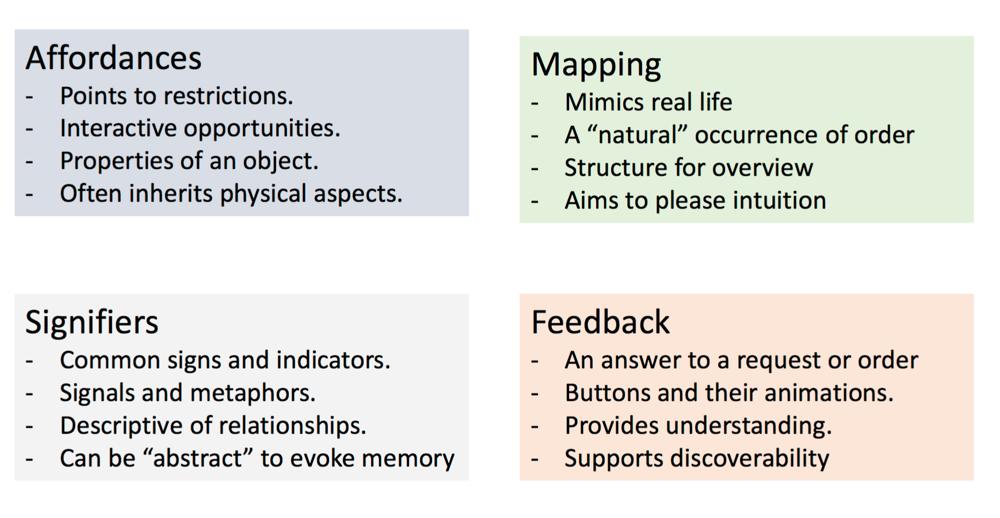
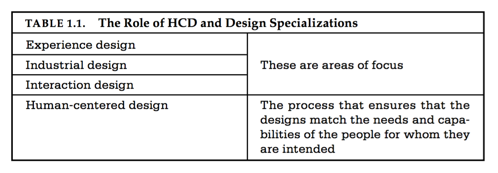
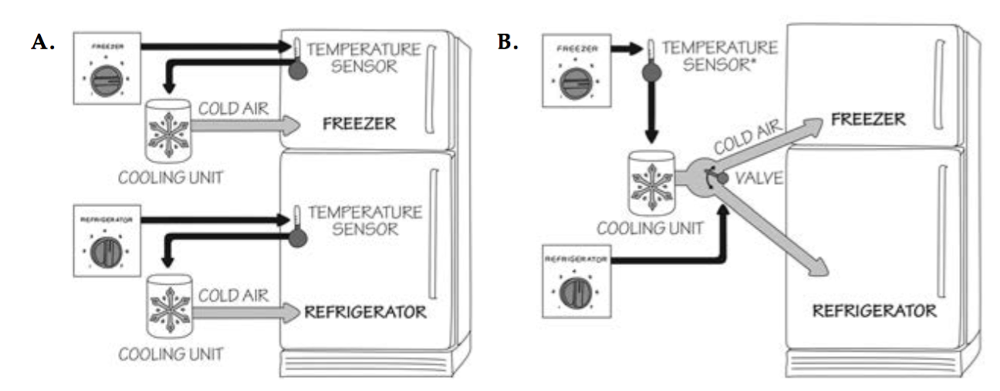

**Industrial design**: The professional service of creating and developing concepts and specifications that optimize the function, value, and appearance of products and systems for the mutual benefit of both user and manufacturer (from the Industrial Design Society of America’s website).

**Interaction design**: The focus is upon how people interact with technology. The goal is to enhance people’s understanding of what can be done, what is happening, and what has just occurred. Interaction design draws upon principles of psychology, design, art, and emotion to ensure a positive, enjoyable experience.


**Experience design**: The practice of designing products, processes, ser- vices, events, and environments with a focus placed on the quality and enjoyment of the total experience.




Engineers are trained to think logically. As a result, they come to believe that all people must think this way, and they design their machines accordingly. 


 The problem with the de.signs of most engineers is that they are too logical

 

 

## Human-Centered Design



The solution is human-centered design (HCD), an approach that puts human needs, capabilities, and behavior first, then de- signs to accommodate those needs, capabilities, and ways of be- having. 




Human-centered design is a design philosophy. It means starting with a good understanding of people and the needs that the design is intended to meet.

Folk husker deres erfaringer med et produkt. 

Når vi interagerer med et produkt, skal vi finde ud af hvordan det fungerer, samt hvilke muligheder det har. **Discoverability**.

Affordances, signifiers, constraints, mappings, and feedback.

The conceptual model - Brugerens opfattelse af siden. Den model, han tidligere har fået, ved lignende sider.

## Affordances


	For an affordance to be perceptible, there is information available such that the actor perceives and can then act upon the existing affordance.


The term affordance refers to the relationship between a physical object and a person.


A chair affords (“is for”) support and, therefore, affords sitting.


Recap: Affordance er ikke en egenskab til ojektet. Affordance er forholdet til brugeren. 

Et glas *affords* transparency. Det at vand ikke kan flyde igennem, er dernæst en anti-affordance - the prevention of interaction.

Fugle flyver ofte ind i glas, fordi de netop ikke opfatter *affordance*.

**False affordance** er et objekt der udtrykker en funktion, men intet kan. Fx. en placebo knap.

**Hidden affordance** er muligheder ved et objekt, som brugeren ikke ser. Fx at en sko kan åbne en øl. 

To be effective, affordances and anti- affordances have to be discoverable—perceivable. 

## Signifiers


Signifiers communicate where the action should take place. We need both.


Fx. Skub/træk på en dør.


De kan ligeledes være utilsigtet, som fx. at følge en sti hvor græsset er trådt ned af folk inden dig.

Eller at der ingen personer står på togstationen - der således indikerer at toget er kørt.

Recap:


* Affordances are the possible interactions between people and the en- vironment. Some affordances are perceivable, others are not.
* Perceived affordances often act as signifiers, but they can be ambiguous.
* Signifiers signal things, in particular what actions are possible and how they should be done. Signifiers must be perceivable, else they
fail to function.

## Mapping

Forholdet mellem to ting. 



Natural mapping, by which I mean taking advantage of spatial analogies, leads to immediate understanding. For example, to move an object up, move the control up.
Conceptual model

En forkert mapping - som her.. To controls, der giver indtryk (Conceptual model) af to forskellige følere. - I virkeligheden en, med en tilknyttet blæser.

## Feedback

Ever watch people at an elevator repeatedly push the Up button, or repeatedly push the pedestrian button at a street crossing?

Ingen feedback, skaber frustration.

Feedback - videregive resultatet af en handling. 

Mangelfuld feedback - som fx beeplyde. Kan blive opfattet som en *backseat driver*. Der forstyrrer mere end det hjælper.

	Backseat drivers are often correct, but their remarks and comments can be so numerous and continuous that instead of helping, they become an irritating dis- traction. Machines that give too much feedback are like backseat drivers.

Skab et hieraki i feedbacken. Vigtigt - mindre vigtigt.

## Conceptual model

En conceptuel model - er når brugeren danner sig en model baser på simili. 
*En computer indeholder mapper og foldere. * 
Hvilket er en måde conceptualisere designet, og på denne måde gøre nemmere at forstå. 

Recap: Conceptual model er brugerens forståelse for hvordan ting fungerer.

Kan være baseret på forklaringer fra andre, eller tidligere erfaringer.

	A good conceptual model allows us to predict the effects of our actions.
	
