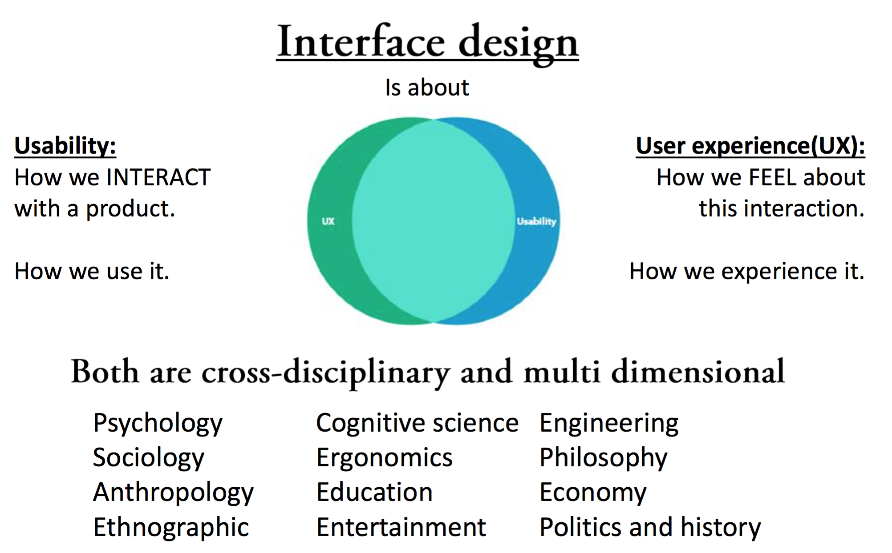

## Interface Design

		Cooper: The success of any design depends on the products ability to answers user needs. Without knowledge about users we have little chance of success.

## Kvalitativ

	What customers think and feel about your product or service.

	What motivates customers to choose between different products.

Anvendes til at opnå indsigt af dybdegående og eksplorativ karakter.

Kvalitative markedsanalyser besvarer ofte spørgsmål som ”hvad”, ”hvorfor” og ”hvordan”. Fx: Hvordan opfattes mærket X? Dvs. indsigt der går i dybden.  Læs mere om kvalitative markedsanalyser.

###Metode

Ved brug af kvalitativ metode opnår du indblik i personers indre følelser og motiver. Du får viden om personerne på det latente niveau og finder frem til dybere behov og præferencer, hvilket er afgørende faktorer for købsbeslutning og præferencedannelse. Kvalitative markedsanalyser er kendetegnet ved åbenhed og en udforskende tilgang, hvor der tages udgangspunkt i målgruppens egne beskrivelser. Resultaterne kan ikke generaliseres.

Bl.a. dybdeinterview, duointerview og fokusgruppe.

## Kvantitativ

	What users do, how they do it, when they do it and where.

	How old are users, where do they live, what do they do.

	Are users happy or unhappy with your product or service.

	Is A or B the best solution for this problem (what about C).

	It is all about what users do (not what they say or think they do).

Anvendes til at kortlægge en gruppe af personer på en række ensartede kvantificerbare variable.

Kvantitative markedsanalyser besvarer typisk spørgsmål som ”hvor mange” og ”hvor meget”. Fx: Hvor mange kender mærket xxx? Dvs. indsigt der går i bredden. Læs mere om kvantitative markedsanalyser.

###Metode

Ved brug af kvantitativ metode opnår du viden på det manifeste niveau om en bred og repræsentativ skare af personer. Data kan således kvantificeres og resultaterne generaliseres. Kvantitative markedsanalyser anvendes endvidere ofte til at teste foruddefinerede hypoteser og er dermed ikke af eksplorativ karakter.

Bl.a. telefoninterview, online spørgeskema, postalt spørgeskema og hall-test.
