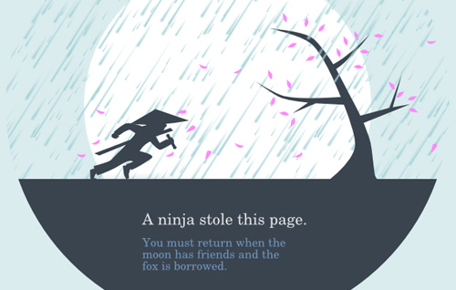

# Implementation-centric - Metaphoric, Idiomatic. 

Side 300 i bogen.

## Implementation-centric

Hvordan det reelt virker? En 1-1 skiltring af situationen.

**Reelt virker - RÅ**

  "The implementation-centric interfaces are based on understanding how things actually work under the hood."

## Idiomatic

Lære ny måde. Fx. Apple. 

Vi kender det ikke grundet metafor eller andet. Vi har bare lært det.

En mus har vi lært at bruge idiomatic. Intet indikerer at den virker sådan, vi har bare lært det.

## Metafor

On the web, our senses are limited.

As designers, we need to present information carefully to make sure our users think, feel and do the right thing.

Vi designer oplevelsen for brugeren. From bottom up.

Metaforer er en god måde, at få brugeren til at forstå det. Ved at sammenligne det med dagligdags objekter.

Our conceptual system is largely metaphorical, which means that we use metaphors to reason and understand the world.

Vores conceptuelle system er primært baseret på metaforer - **"Det er ligesom"**. Vi bruger metaforer til at forstå verden.

## 1. Metaforer kan gøre akstrakte ting til noget konkret

Metaforer er en god måde at få brugeren til at forstå abstrakte og ukendte ting. 
Ved at sammenligne abstrakte ting med noget konkret, er det nemmere for brugeren at forstå.

  Windows introducerede Dokumenter og foldere, for at få brugeren til at forstå *DOS*

Ikoner er ofte ting vi kender fra den fysiske verden, som så er overført. For at få brugeren til at forstå.

404 er et ukendt koncept for brugeren. Konkretisere det for brugeren.

Many Web users don’t know what a 404 error is, and generic 404 error pages may be intimidating to them. Instead of giving a technical explanation of why the requested page is not available, the user gets a humorous image of a running ninja who stole the page being requested.

## 2. Metaforer skaber genkendelighed

Når brugeren genkender noget, forsøger de at opnå forståelse for det. De skaber en conceptuel model, baseret på deres forståelse.
Og danner et indtryk, af hvad de kan forvente.

Follansbee explains that we use patterns to get an idea of what to expect. Recognizing mental patterns helps us to accept and understand the unfamiliar.

Sketchbook -> Ligner papir, for at brugeren kan benytte deres **conceptuelle model* for at forstå det.

## 3. Metaforer kan trigger følelser 

You can use metaphors to trigger emotions. Emotions not only make your design appealing to people, but also more effective, pleasurable and memorable.

Et kaffe-kop ikon, fremkalder en betydning samt en følelse af hyggge. 

## 4. Metaforer kan tiltrække opmærksomhed

Flotte dagligdagselementer kan tiltrække brugerens opmærksomhed.

## 5. Metaforer can motivate users into action

En counter, kan fx. motivere brugeren til at registrere sig, inden det er for sent. 
Den overførte betydning af counteren, kan virke som en motivator for brugeren.

By translating interactions that we know from the real world to the Web, we can also transfer our knowledge to the screen. This way, metaphors can be very engaging and actionable because we intuitively know what to do.

Recap:

* Explain abstract or complex concepts
* Create a sense of familiarity
* Trigger emotions
* Draw attention to your site or certain components of it
* Motivate users to take action

