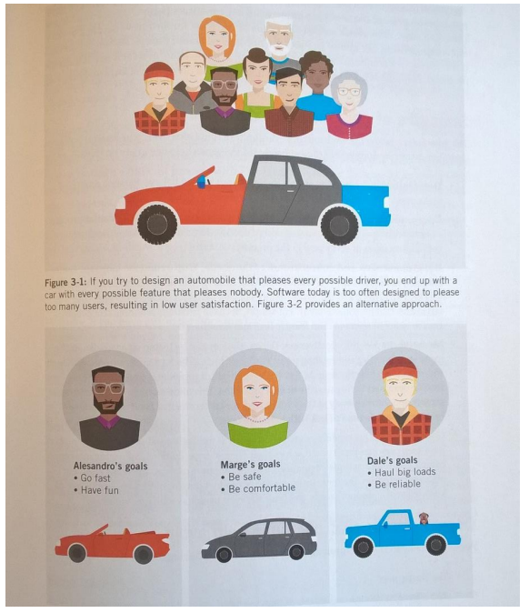
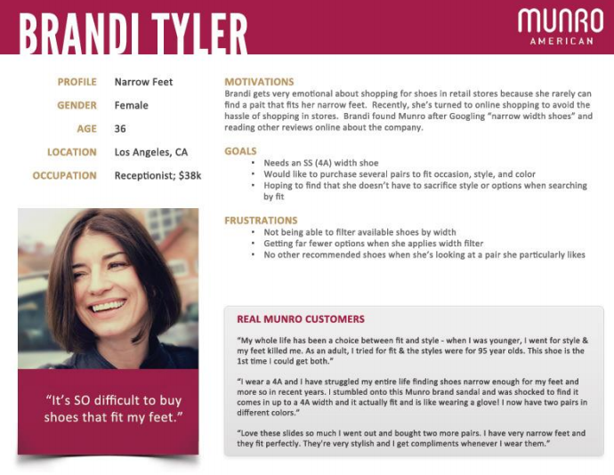
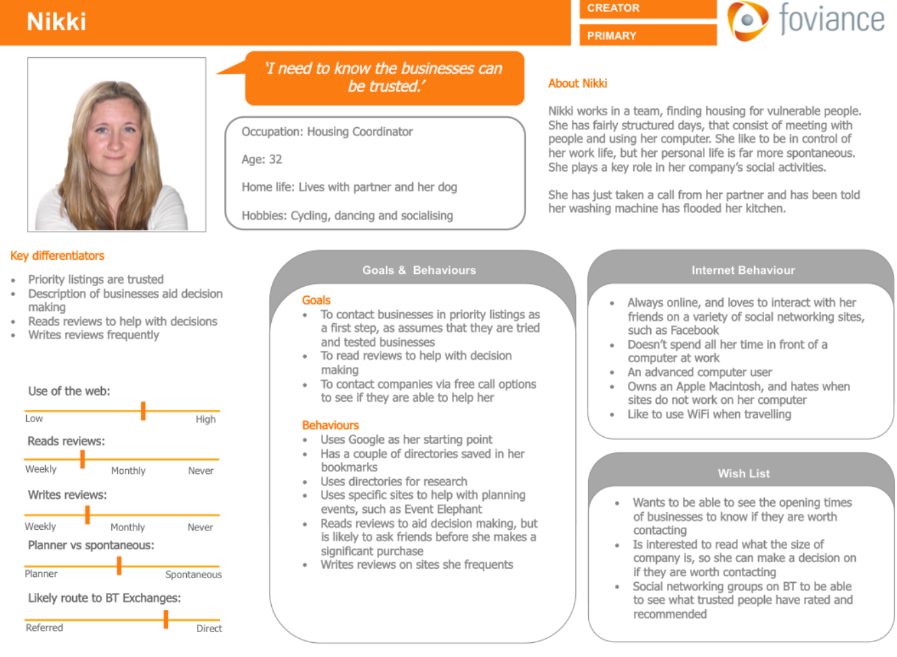
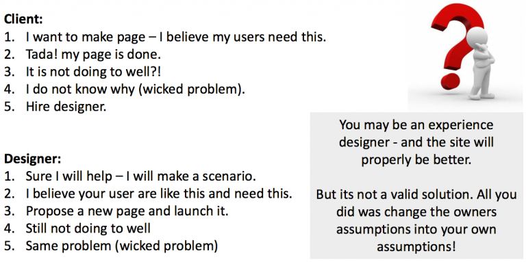
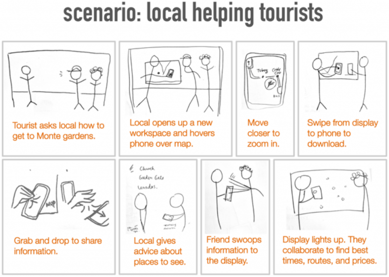
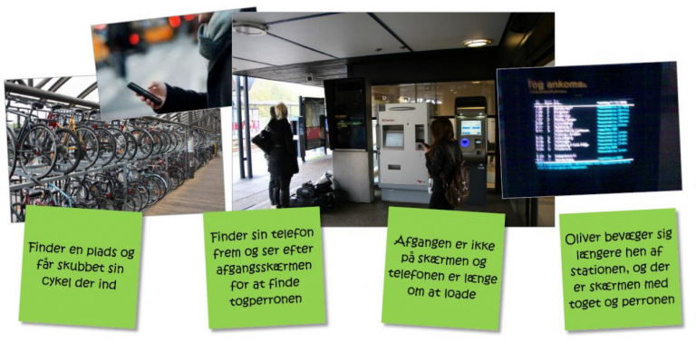

#Personas, Scenario and Use case

Emnerne findes også særskilt.

###Use cases

Focus on the technical system and less on the user himself

Use cases can be used to focus on problematic interaction with a system that you want to improve. They tend to see all users as equal and make no distinction for context or use situation.

###Personas

Provide information about whom the user is. Including specific information about why the user want to engage with a certain product, but not how this is done. It’s models that collect and qualify your research data. They are made up of the data you collected when you researched different users.

Why are personas great for answering wicked problems? Personas allows you to think and work with users and their attitudes and behaviors in specific contexts. They personify the design situation and evoking empathy.

More Personas gather user groups together and represent them as archetypes (not stereotypes) which lets you test your design against a large part of the user group.

Use segmentation tools, user profiles and demographics to inform you persona, but don’t rely on them.

Personas (in Cooper’s point of view)…

1. Are based on research
2. Represents types of users of a specific product
3. Explore ranges of behaviour
4. Have motivations
5. Represents relevant nonusers

## Scenarios

Two basic kinds: Present scenarios and Future scenarios.

#### Present Scenarios (Use scenario or context scenario)

* Show what is now
* Uncovers current use experience and potential problems
* Dos not focus on a particular problem but shows the entire user experience – including both good and bad

#### Future Scenarios (Solution scenario or key path scenario)

* Show what ought to be when the solution is implemented
* Predicts user experience after implementation of changes
* Re-evaluates goal of design continuously
* Restate the goal of the design process and focus of team

#### A good scenario answer the following questions:

* Who is the user? (the persona)
* What are the users goals and motivations
* What is necessary for the user to accomplish her goal?
* Why would the user engage with this particular product or company. What would lure the user to this moment?
* What does the user need to do – to interact with? How is the goal accomplished? And how does the user feel?

#### Five easy step guide (Cooper):
Cooper's guidelines

* Create problem and vision statements (Agree upon the “what“ and “how“)
* Explore and brainstorm (Designing. Move from analyzing data to solution thinking)
* Identify persona expectations (Copy-past from persona and fill out)
* Construct context scenarios (Make it believable and real – not systematic)
* Identify design requirements (Data, functions and context needs)
* Moving on to the actual design part – the fun part

## Scenario Examples

### Recap

Personas (ifølge Cooper)…

* Er baseret på research
* Repræsenterer typer af brugere til et specifikt produkt
* Finder ud af opførsler
* Har motivationer
* Repræsenterer en relevant ikke-bruger (anti persona – har vi ikke brugt)
