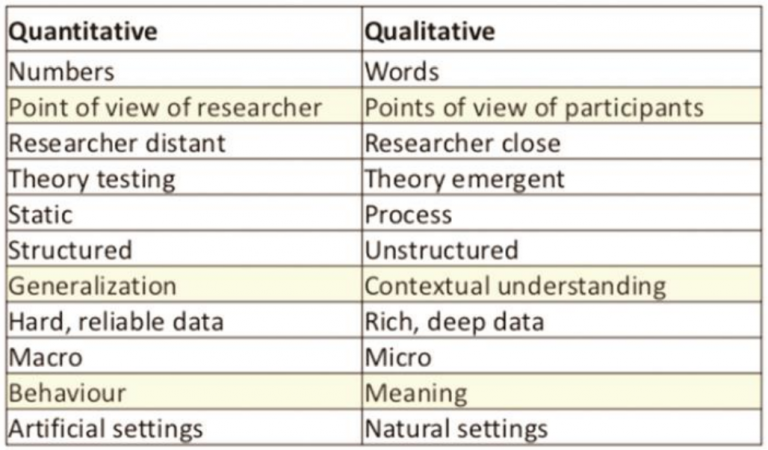

# User-research

The Research phase employs ethnographic field study techniques (observation and contextual interviews) to provide qualitative data about potential and/or actual users of the product.

One of the principal outcomes of field observation and user interviews is an emergent set of behavior patterns—identify able behaviors that help categorize modes of use of a potential or existing product.

##User interviews

### Kvantitativ (Mange/tal)

* What users do, how they do it, when they do it and where.

* How old are users, where do they live, what do they do.

* Are users happy or unhappy with your product or service.

* Is A or B the best solution for this problem (what about C).

* It is all about what users do (not what they say or think they do).

### Kvalitativ (Info/interview)

* What customers think and feel about your product or service.

* What motivates customers to choose between different products.

* If the use experience influences customers and in what way.

* What “messages” have the most impact – positive and negative.

* How price affects decision-making compared to ideology and style

* Whether there is demand for a new function or service

## Quantitative vs. Qualitative summary

## Visualiseret

* Attitudinal vs. Behavioral
    "Hvad folk siger=" - "Hvad folk gør?"
* Qualitative vs. Quantitative
    Kvalitativ - Hvordan? Hvordan fixer vi det?

    Kvalitativ - Hvor mange? Hvor meget?

*Hvad folk gør? - Behavioral*(Passiv)

A/B Split test, Eyetracking

# UX metoder

1. Usability-Lab Studies: participants are brought into a lab, one-on-one with a researcher, and given a set of scenarios that lead to tasks and usage of specific interest within a product or service.
2. Ethnographic Field Studies: researchers meet with and study participants in their natural environment, where they would most likely encounter the product or service in question.
3. Email Surveys: a survey in which participants are recruited from an email message.
4. Participatory Design: participants are given design elements or creative materials in order to construct their ideal experience in a concrete way that expresses what matters to them most and why.
5. Focus Groups: groups of 3-12 participants are lead through a discussion about a set of topics, giving verbal and written feedback through discussion and exercises.
6. Interviews: a researcher meets with participants one-on-one to discuss in depth what the participant thinks about the topic in question.
7. Eyetracking: an eyetracking device is configured to precisely measure where participants look as they perform tasks or interact naturally with websites, applications, physical products, or environments.
8. Usability Benchmarking: tightly scripted usability studies are performed with several participants, using precise and predetermined measures of performance.
9. Moderated Remote Usability Studies: usability studies conducted remotely with the use of tools such as screen-sharing software and remote control capabilities.
10. Unmoderated Remote Panel Studies:  a panel of trained participants who have video recording and data collection software installed on their own personal devices uses a website or product while thinking aloud, having their experience recorded for immediate playback and analysis by the researcher or company.
11. Concept Testing: a researcher shares an approximation of a product or service that captures the key essence (the value proposition) of a new concept or product in order to determine if it meets the needs of the target audience; it can be done one-on-one or with larger numbers of participants, and either in person or online.
12. Diary/Camera Studies: participants are given a mechanism (diary or camera) to record and describe aspects of their lives that are relevant to a product or service, or simply core to the target audience; diary studies are typically longitudinal and can only be done for data that is easily recorded by participants.
13. Customer Feedback: open-ended and/or close-ended information provided by a self-selected sample of users, often through a feedback link, button, form, or email.
14. Desirability Studies: participants are offered different visual-design alternatives and are expected to associate each alternative with a set of  attributes selected from a closed list; these studies can be both qualitative and quantitative.
15. Card Sorting: a quantitative or qualitative method that asks users to organize items into groups and assign categories to each group. This method helps create or refine the information architecture of a site by exposing users’ mental models.
16. Clickstream Analysis: analyzing the record of screens or pages that users clicks on and sees, as they use a site or software product; it requires the site to be instrumented properly or the application to have telemetry data collection enabled.
17. A/B Testing (also known as “multivariate testing,” “live testing,” or “bucket testing”): a method of scientifically testing different designs on a site by randomly assigning groups of users to interact with each of the different designs and measuring the effect of these assignments on user behavior.
18. Unmoderated UX Studies: a quantitative or qualitative and automated method that uses a specialized research tool to captures participant behaviors (through software installed on participant computers/browsers) and attitudes (through embedded survey questions), usually by giving participants goals or scenarios to accomplish with a site or prototype.
19. True-Intent Studies: a method that asks random site visitors what their goal or intention is upon entering the site, measures their subsequent behavior, and asks whether they were successful in achieving their goal upon exiting the site.
20. Intercept Surveys: a survey that is triggered during the use of a site or application.

# Interview
[Empiri Lesson 2](http://www.mikejakobsen.com/pdf/lesson02.pdf)

*Unstructured or nondirective interview*
- En samtale. Hvor relevante ting bliver spurgt ind til, i take med at de kommer op.  (Generel input)
*Structured or directive interview*
- Trin-for-trin interview. Med lidt frirum. (God til at belyse problematikker man allerede kender) 
*Strict interview*
- En survey, der bliver læst op. Fra a til b. Meget strikt. (En survey, med brugerens mimic) 
*Group interview*
- Ala focus group. Interview med en gruppe synergy. God til at opnå indsigt, uden at lede interviewet.

# Focus Group

Kombinationen af mennesker med forskellige ideer, skaber en god synergy.

Deltagerne hjælper hinanden med at nå til bunds i det adspungte. 

    Important to keep it open - keep it qualitative and focus on the how and why of user attitude and feeling.

# Focus group - Fire typer

*Exploratory*
Opdagende af natur. Benyttes i starten af design processen.

Recap: Brugeren attitude, og forståelse.

*Feature prioritization – focus on shape:*
**Trin to i design processen**

Hvad brugeren vil have.. Hvad skal det kunne?

*Trend exploration - focus on change*

Redesign. Gentænke trends, forventninger og krav.

*Competitive – focus on what works*

Hvad vil brugeren have? Hvad tiltrækker dem?
