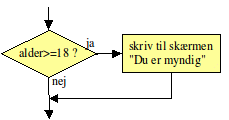
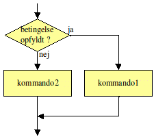

# Variabler, Data typer og Basic

Strongly typed
CamelCase

    int indeholderTal;
    string indeholderTekst;

    int indeholderTal = 200;

### Primitiv Data Types

Integer
    Byte, short, int, long
Floating Point
    Float, double
Character
    Et enkelt bogstav
Boolean
    True/False

### Type Conversion

int iVal = 50;

long Lval = iVal;

### Metoder

Math.sqrt(), Math.sin() og de andre matematiske funktioner og andre kommandoer, f.eks. System.out.println(), kaldes under et metoder.

En metode er en navngiven programstump, der kan gøre et eller andet eller beregne en værdi. F.eks. gør System.out.println() det, at den skriver tekst på skærmen og Math.sqrt() beregner en kvadratrod. Når en metode nævnes i teksten, skriver vi altid ”()” bagefter, så man kan se, at det er en metode.

      hypotenuse = Math.sqrt(a*a + b*b);

Math.sqrt er navnet på metoden og man kalder det, der står inde i ”()”, for argumentet eller parameteren.

Et metodekald er en nævnelse af en metodes navn efterfulgt af de rigtige parametre. Parametrene er omgivet af parenteser.

Ved et metodekald kan man som parameter indsætte ethvert udtryk, der giver et resultat af den rigtige type
Alt, der giver et resultat af den rigtige type, er altså tilladt: Konstanter, variabler, regneudtryk og resultatet af et andet metodekald:

double v,x;
x = Math.sqrt(100);             // konstant som parameter
x = Math.sqrt(x);               // variabel som parameter
x = Math.sin(Math.sqrt(0.3));  // værdi af andet metodekald som parameter
Ved et kald uden parametre skal man stadig have parenteserne med. Her er et eksempel på et metodekald af Math.random(), som er en metode, der skal kaldes uden parametre:

          double tilfældigtTal;
          tilfældigtTal = Math.random();

### Logiske variabler (Boolean)

en logisk variabel, kan indeholde værdien sand eller falsk. Den bruges mest til at huske, om noget er sandt eller ej, men kan også repræsentere noget, der kun har to tilstande, f.eks. om en lampe er tændt eller slukket.

Variabeltypen hedder boolean og den erklæres med f.eks.:

    boolean detErForSent;

En boolesk variabel kan kun sættes til værdierne true eller false. F.eks.:

    detErForSent = false;

På højre side af lighedstegnet kan stå et logisk udtryk, dvs. et udsagn, der enten er sandt eller falsk, f.eks. "klokken er over 8" (her forestiller vi os, at vi har variablen klokken).

    detErForSent = klokken > 8;

### If/else

    if (alder >= 18) System.out.println("Du er myndig");

    if (alkoholpromille > 0.5) System.out.println("Lad bilen stå");

    		public class Alder
    		{
    			public static void main(String[] arg)
    			{
    				int alder;
    				alder = 15;

    				if (alder >= 18) System.out.println("Du er myndig.");

    				System.out.println("Du er " + alder + " år.");
    			}
    		}

### Loops

while-løkken har formen:

      while (betingelse) kommando;

Kommandoen udføres igen og igen, så længe betingelsen er opfyldt. Dvs. før kommandoen udføres, undersøges betingelsen og det kontrolleres, at den er opfyldt (se rutediagrammet til højre).

Oftest vil man udføre mere en én kommando og anvender derfor en blok til samle kommandoerne:

    while (betingelse) {
      kommando1;
      kommando2;
      ...
    }

Her er et eksempel:

    public class Alder4
    {
      public static void main(String[] arg)
      {
        int alder;
        alder = 15;

        while (alder < 18)
        {
          System.out.println("Du er "+alder+" år. Vent til du bliver ældre.");
          alder = alder + 1;
          System.out.println("Tillykke med fødselsdagen!");
        }

        System.out.println("Nu er du "+alder+" år og myndig.");
      }
    }

På et tidspunkt når alderen 18, og slutter *loopet*.

