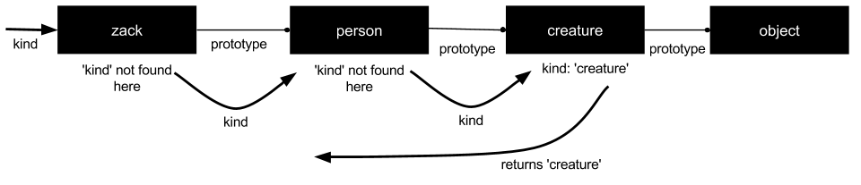

##Objects

Javascript simple types:
* numbers _(has object-like methods but they are immutable)_
* strings _(has object-like methods but they are immutable)_
* booleans _(has object-like methods but they are immutable)_
* null
* undefined

**All other values are _objects_** including arrays and functions.

Objects are **class free**, can contain other objects and can inherit properties from their prototypes (which can _reduce object initialisatioin time and memory consumption_).

###Object Literals

* An object literal is _zero or more comma-separated name/value pairs surrounded by curly braces_ {}

```javascript

var empty_object = {};

var today = {
	day: "Wednesday",
	month: "April",
	year: 2014,

	weather: { //objects can contain nested objects like this one
		morning: "sunny",
		afternoon: "cloudy"
	}
}
```

###Retrieval

* Can be done with either dot notation `today.weather.morning` or with square brackets `today['month']`
* Or operand (||) can be used to fill in default values for nonexistent data to prevent and _undefined_ error: `var weath = today.weather.evening || "unknown"`


###Update

* Assigning a property value to an object **overwrites** any existing property values with that property name

###Reference

* Objects refer to each other, they don't hold duplicate copies of data

### Prototype

* Every object has a prototype object from which it inherits properties
* _Object.prototype_ comes standard with Javascript and is almost like a 'root parent'

* The `Object.create` method is now available in ES5 (but the method is in the book if required for older versions)
* If an object does not have a property you ask it for, it will **keep looking up the prototype chain until it finds it**
	* If the property *does note exist* anywhere in the chain, it will return _undefined_
* A new property is _immediately visible_ to all of the objects below it in the chain once created

###Reflection

* Determining what properties an object has
* Using `typeof` **includes all properties in the prototype chain** including functions
* To avoid inherited properties, use `hasOwnProperty(type);` which returns _true_ if that property exists only in that object itself (not the chain)
```javascript
today.hasOwnProperty('number')  //will return true
today.hasOwnProperty('constructor')   //will return false
```

###Enumeration

* Best way to enumerate all the properties you want is a for loop:
```javascript
var i;
var properties = [
	'day', 'month', 'year'
	];
for (i = 0; i < properties.length; i++) {
	document.writeIn(properties[i] + ':' + today[properties[i]]);
}
```
* This ensures you get the **properties you want** (i.e. not up the prototype chain) and in the **order you want**, as opposed to a _for in_ loop which achieves neither of these

###Delete

* Removes property from object, but also **reveals property from further up the prototype chain** if it exists
* Format: `delete today.month`

###Global Abatement

* One way to mitigate the risks of global variables is to _create a single global variable_ which then contains your whole application

```javascript
var MYAPP = {}

MYAPP.today = {
	day: "Wednesday",
	month: "April",
	year: 2014,

	weather: { //objects can contain nested objects like this one
		morning: "sunny",
		afternoon: "cloudy"
	}
}
//Making sure all other variables (like today) are contained within this one global variable (MYAPP) means none of them have global scope and therefore the risk of naming conflicts, etc in your application is reduced
```
* Closures are also a way of mitigating the risks of global variables
* Note: **Most [Javascript MVCs](http://coding.smashingmagazine.com/2012/07/27/journey-through-the-javascript-mvc-jungle/) these days (2014) will take care of wrapping your app for you**
