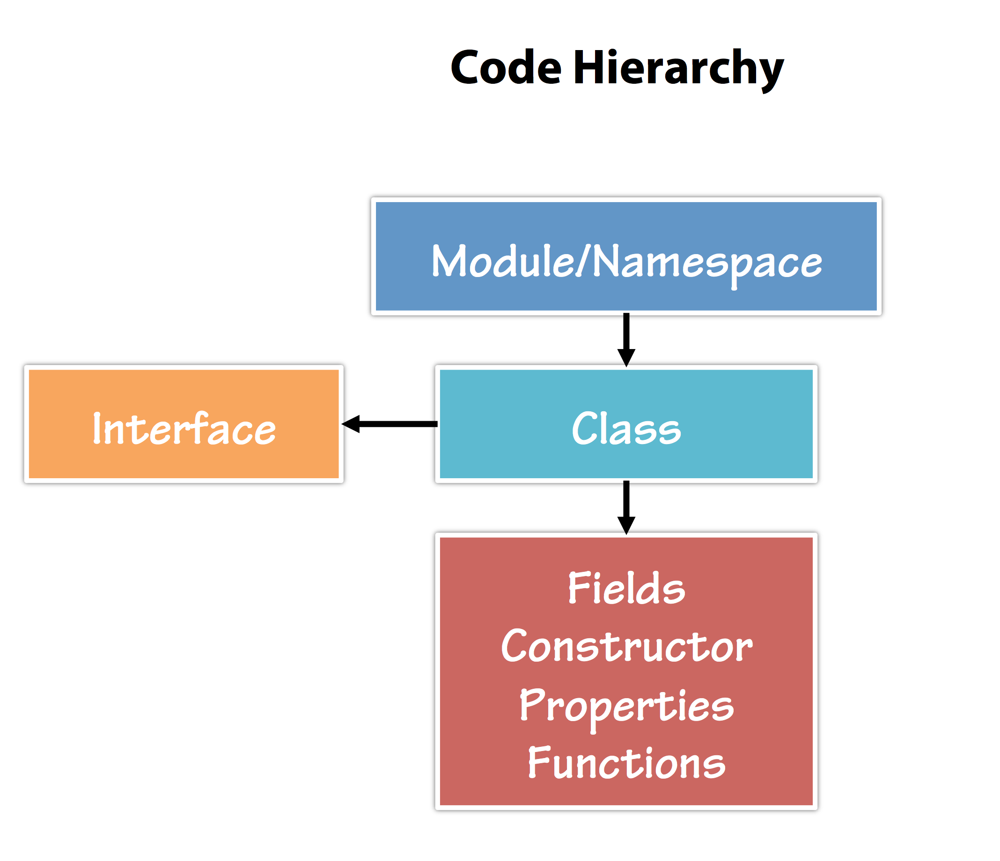
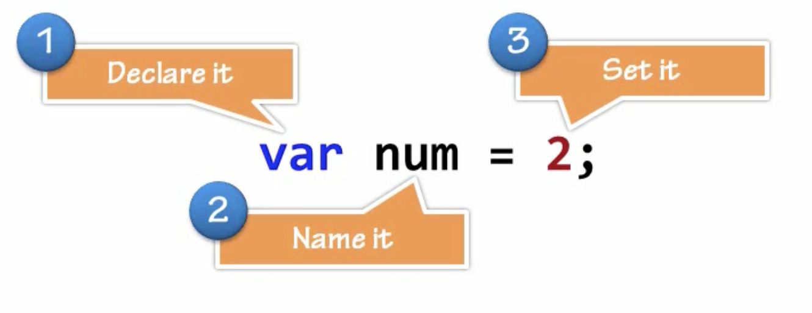

# TypeScript

| Keyword          | Hva' gør den?                                          |
|------------------|--------------------------------------------------------|
| class            | Container for members such as properties and functions |
| constructor      | Provides initialization functionality in a class       |
| exports          | Export a member form a module                          |
| extends          | Extend a class or interface                            |
| implements       | Implement an interface                                 |
| import           | Import a module                                        |
| interface        | Defines code contract that can be implemented by types |
| module/namespace | Container for classes and other code                   |
| public/private   | Member visibility modifiers                            |
| ...              | Rest parameter syntax                                  |
| =>               | Arrow syntax used with definition and functions        |
| < typename>       | <> characters use to cast/convert between types        |
| :                | Separator between variable/parameter names and types   |

## Code Hierarchy

In javascript you just have functions. You use namespaces to get it out of the global scope



## Primitive Types

### Javascript


### Typescript


Type | Code
--- | ---
Any type (explicitly untyped) | `any`
void type (null or undefined, use for function returns only) | `void`
String | `string`
Number | `number`
Boolean | `boolean`

## Enum
```typescript
enum Options {
    FIRST,
    EXPLICIT = 1,
    BOOLEAN = Options.FIRST | Options.EXPLICIT
}
```

## Custom primitives. Type aliases

Type | Code
--- | ---
Integer | `type int = number`
Float | `type float = number`

(!) The JS does not have types Integer and Float. It is only the type aliases. So you can make your code more documented and give a hint for programmers.


## String Literal Types
Type | Code
--- | ---
CSS type property position | `type cssPosition = "absolute" | "relative" | "fixed";`


## Object type literals

Concept | Code
--- | ---
Object with implicit Any properties | `{ foo :any; bar :any }` or `{ foo; bar; }`
Object with optional property | `{ required :Type; optional? :Type; }`
Hash map | `{ [key :string] :Type; }`
Indexable types | `{ [id :number] :Type; }`

## Arrays

Concept | Code
--- | ---
Array of strings | `string[]` or `Array<string>`
Array of functions that return boolean | `{() :boolean;}[]` or `Array<()=>boolean>`

## Indexable Interface
Similarly to how we can use interfaces to describe function types, we can also describe types that we can “index into” like a[10], or ageMap["daniel"]. Indexable types have an index signature that describes the types we can use to index into the object, along with the corresponding return types when indexing. Let’s take an example:

```typescript
interface StringArray {
    [index: number]: string;
}

let myArray: StringArray;
myArray = ["Bob", "Fred"];

let myStr: string = myArray[0];
```
Above, we have a StringArray interface that has an index signature. This index signature states that when a StringArray is indexed with a number, it will return a string.


## Tuples
A tuple is a finite ordered list of elements. A tuple in TypeScript is much like a typed list except that it is immutable (unchangeable) once created.

Concept | Code
--- | ---
Tuple of list with first item number and second string | `let list :[number, string] = [123, 'abc'] `
or | `let list :Array<number, string> = [123, 'abc'] `

Tuple type
```typescript
type keyValuePair = [number, string];
let list :keyValuePair = [123, 'abc']
```

**Interface represents a tuple type**
```typescript
interface KeyValuePair extends Array<number | string> { 0: string; 1: number; }
```

## Functions

Concept | Code
--- | ---
Function | `{ (arg1 :Type, argN :Type) :Type; }` or `(arg1 :Type, argN :Type) => Type;`
Constructor | `{ new () :ConstructedType; }` or `new () => ConstructedType;`
Function type with optional param | `(arg1 :Type, optional? :Type) => ReturnType;`
Function type with `rest` param | `(arg1 :Type, ...allOtherArgs :Type[]) => ReturnType;`
Function type with static property | `{ () :Type; staticProp :Type; }`
Default argument | `function fn(arg1 :Type = 'default') :ReturnType {}`
Arrow function | `(arg1 :Type) :ReturnType =>; {}` or `(arg1 :Type) :ReturnType =>; Expression`

## This based type guards

```typescript
interface IteratorResult<CompletedType, SuspendedType> {
    value :CompletedType | SuspendedType;
    done :this is { value :CompletedType };
}
```

## Support for F-Bounded Polymorphism
Type parameters as constraints

```typescript
function assign<T extends U, U>(target :T, source :U) {}
```

## Overload

How resolve this exception?

	TS2345: Argument of type '...' is not assignable to parameter of type '...'. Type '...' is not assignable to type '...'

One solution with overload:

```typescript
foo(a :string  ) :void;
foo(a :string[]) :void;
foo(a) {
	if (!Array.isArray(a)) a = [a];
	a = a.map(x => x.toUpperCase());
	console.log(a);
}

foo('abcdef'); // Ok
foo(['abc', 'def']); // Ok
foo(123); // Error!
```

## Generics

**Function using type parameters**

```typescript
<T>(items :T[], callback :(item :T) => T) :T[]
```

**Interface with multiple types**

```typescript
interface Pair<T1, T2> {
   first :T1;
   second :T2;
}
```

**Constrained type parameter**

```
<T extends ConstrainedType>() :T
```

## Generic type aliases
Type aliases requiring type parameters

```typescript
type Source<T> = T | (() => T);

function foo<T>(p: Source<T>) :T {
   return (typeof p === "function") ? p() : p;
}

// Usage:
foo<string>('abc');
foo<()=>number>(() :number => 123);
foo<()=>number>(function() :number { return 456 });
```

But compiler show error when using union type containing a function:

	Cannot invoke an expression whose type lacks a call signature.


## Check invoke an expression whose type lacks a call signature

**Typecast**
```typescript
type Source<T> = T | (() => T);

function foo<T>(p: Source<T>) :T {
   return (typeof p === "function") ? (<()=>T>p).call(this) : p;
}
```

**Type assertion**
```typescript
type Source<T> = T | (() => T);

function foo<T>(p: Source<T>) :T {
   return (typeof p === "function") ? (p as (()=>any))() : p;
}
```

**Best practice (may be?)**

Is the same that typeof === "function" doesn't strip the object type. One way is to check typeof === "function" and assert that as a test for whether it's a callable object or not using **user-defined type guards**.

```typescript
type Source<T> = T | (() => T);

function foo<T>(p: Source<T>) :T {
   return (((p :any) :p is Function => typeof p === "function")(p)) ? p() : p;
}
```


## Type casting (assertion) and hinting

Concept | Code
--- | ---
Call map() from type `a :string|string[]` | `(<string[]> a).map(s=>s.toUpperCase())`
... in JSX | `(a as string[]).map(...)`
Assertion for multi type `let v :string|number` | `parseInt( <string> v )`


## User defined type guard functions
```typescript
let a :string|string[];

if (((obj :any) :obj is [] => 'map' in obj)(a))
    a.map( x => x.toUpperCase() );
```

**Or**
```typescript
let isValidArray = (obj :any) :obj is string[] =>
		/Array/.test(Object.prototype.toString.call(obj))
		&& 'map' in obj
		&& 'function' === typeof obj.map.call
	;


let a :string|string[];

if (isValidArray(a))
	a.map( x => x.toUpperCase() );
```

## Dinamic type

Concept | Code
--- | ---
Dinamic type of any object | `type typeOfObject = typeof SomeObject;`

**Example**
```typescript
let Some = Math.round( Math.random() ) ? '' : 1;

type numOrStr = typeof Some;

let foo :numOrStr;
foo = 123;
foo = 'abc';
foo = {}; // Error!
```

## Interface

```typescript
 interface IChild extends IParent, SomeClass {
     property :Type;
     optionalProp? :Type;
     optionalMethod?(arg1 :Type) :ReturnType;
 }
 ```

## Class

```typescript
 class Child extends Parent implements IChild, IOtherChild {

   property :Type;

   defaultProperty :Type = 'default value';

   private _privateProperty :Type;

   static staticProperty :Type;

   constructor(arg1 :Type) {
        super(arg1);
   }

   private _privateMethod():Type {}

   methodProperty :(arg1 :Type) => ReturnType;

   overloadedMethod(arg1 :Type) :ReturnType;

   overloadedMethod(arg1 :OtherType) :ReturnType;

   overloadedMethod(arg1 :CommonT) :CommonReturnT {}

   static staticMethod() :ReturnType {}

   subclassedMethod(arg1 :Type) :ReturnType {
      super.subclassedMethod(arg1);
   }
 }
```
